# AITester Blueprint 4x

AI-powered test automation blueprint.

## Contents

- [Overview](#overview)
- [Chapters](#chapters)
  - [Chapter 01: LLM Basics](#chapter-01-llm-basics)
  - [Chapter 02: Prompt Engineering](#chapter-02-prompt-engineering)
    - [The 54-skill QA prompt suite](#the-54-skill-qa-prompt-suite)
    - [Install a skill](#install-a-skill)
  - [Chapter 03: Local Test Case Generator](#chapter-03-local-test-case-generator)
    - [Features](#features)
    - [File structure](#file-structure)
    - [Running the app](#running-the-app)
    - [Environment variables](#environment-variables)
    - [Data flow](#data-flow)
  - [Chapter 04: JobKit AI](#chapter-04-jobkit-ai)
  - [Chapter 05: Job Tracker AI](#chapter-05-job-tracker-ai)
    - [Features](#features-1)
    - [Tech stack](#tech-stack)
    - [Data model](#data-model)
    - [Running the app](#running-the-app-1)
    - [State flow](#state-flow)
  - [Chapter 06: Branding and LinkedIn Skills](#chapter-06-branding-and-linkedin-skills)
    - [What it produces](#what-it-produces)
    - [File structure](#file-structure-1)
    - [Install the skill](#install-the-skill)
    - [Pack pipeline](#pack-pipeline)
    - [Voice spine](#voice-spine)
    - [Hook ladder](#hook-ladder)
  - [Chapter 07: AI Agents](#chapter-07-ai-agents)
    - [The B.L.A.S.T. protocol](#the-blast-protocol)
    - [A.N.T. 3-layer architecture](#ant-3-layer-architecture)
    - [Running the agent](#running-the-agent)
    - [Anti-hallucination design](#anti-hallucination-design)
    - [Field notes from the build](#field-notes-from-the-build)
  - [Chapter 08: n8n Agents](#chapter-08-n8n-agents)
    - [The Jira agent pair (01, 02)](#the-jira-agent-pair-01-02)
    - [Swapping the brain: local Ollama and Groq (03)](#swapping-the-brain-local-ollama-and-groq-03)
    - [Bug triage into Google Sheets (04)](#bug-triage-into-google-sheets-04)
    - [Production bug RCA pipeline (05)](#production-bug-rca-pipeline-05)
    - [Social media content chain (06)](#social-media-content-chain-06)
    - [Scheduled post generator with human approval (07)](#scheduled-post-generator-with-human-approval-07)
    - [Screenshot to bug reporter (08)](#screenshot-to-bug-reporter-08)
    - [Screenshot to bug reporter UI (09)](#screenshot-to-bug-reporter-ui-09)
    - [Screenshot to bug reporter UI (09)](#screenshot-to-bug-reporter-ui-09)
    - [Cross-chapter takeaway](#cross-chapter-takeaway)
- [Chapter 09: LangFlow](#chapter-09-langflow)
- [License](#license)

## Overview

AITester Blueprint 4x Where we will learn about a lot of things related to:
- AI Agent
- MCPs
- RAG
- LLM evaluations
- Langchain
- Langflow
- ATAN
- and many more things which will make us the AI-powered tester

## Chapters

### Chapter 01: LLM Basics
Foundation concepts of Large Language Models and AI fundamentals.

### Chapter 02: Prompt Engineering

RICE-POT template framework for structured prompt engineering, a Salesforce Selenium test
framework built with the Page Object Model pattern, and a
[54-skill QA prompt suite](chapter_02_Prompt_Eng/prompt_templates/README.md).

#### The 54-skill QA prompt suite

Every skill is a folder holding a `SKILL.md` with YAML frontmatter, so it drops straight into
`~/.claude/skills/` or `~/.codex/skills/` and is invoked by name. 36 skills come from
[skillmasterclass](https://github.com/PramodDutta/skillmasterclass/tree/d8c5108d5ae524b10a5a1c695cdee8cfc018be7b/skillmasterclass/skills)
and are hardened here for credential handling, execution authorization, network isolation, and
evidence redaction. 18 are new: API testing, AI safety and guardrails, and test deliverables.

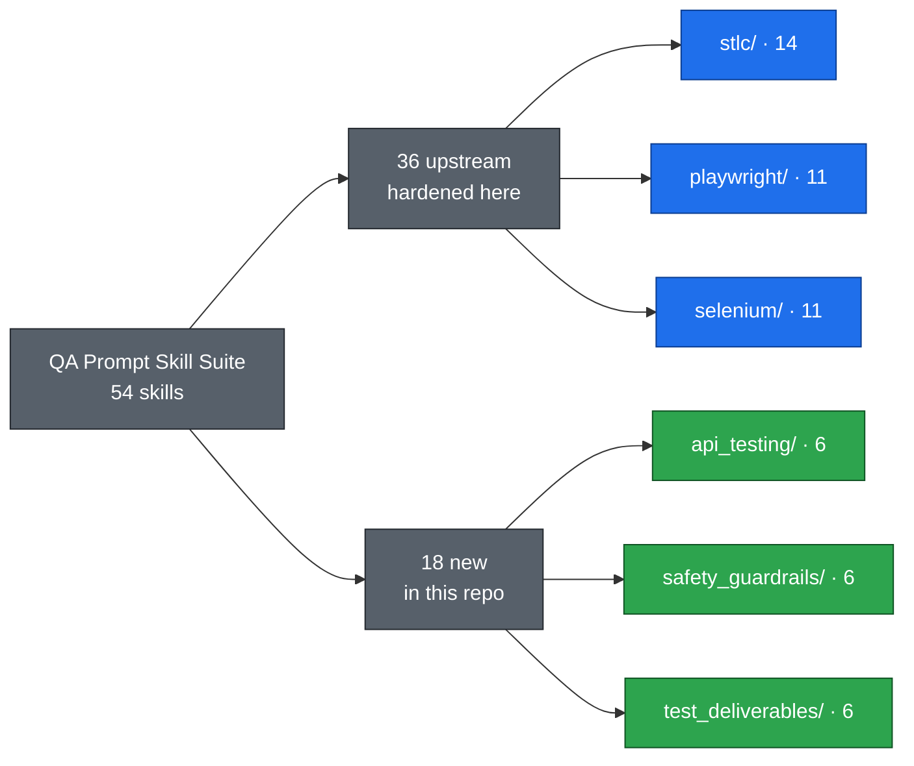

Where each group plugs into the lifecycle:

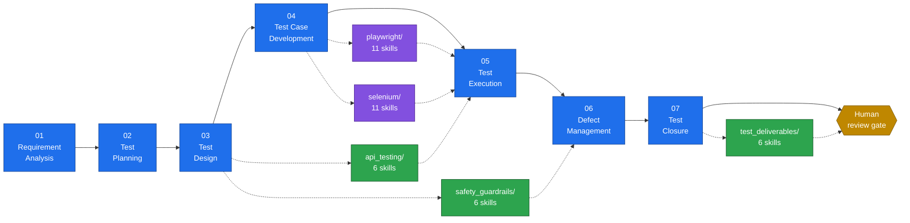

Nothing in the suite is self-approving. Skills report only what the supplied evidence supports,
mark anything unverified as unknown rather than assuming it passed, and stop at a human review
gate before a plan, case set, defect, report, or release decision counts as final.

<details>
<summary><b>STLC · 14 skills</b>: requirement analysis through test closure</summary>

| Skill | What it does |
| --- | --- |
| `jira-requirement-analyzer` | Score a JIRA ticket against a readiness checklist, return gaps, ambiguities, risks, and clarifying questions |
| `test-plan-generator` | Fetch a ticket and fill the standard test plan template, stopping for human review |
| `test-scenario-designer` | Derive positive, negative, boundary, and cross-role scenarios traced to each acceptance criterion |
| `api-test-designer` | Map endpoint or contract coverage across happy path, schema, auth, negative, boundary, and idempotency |
| `test-case-writer` | Expand approved scenarios into preconditions, ordered steps, expected results, and required data |
| `test-data-generator` | Produce labeled valid, invalid, boundary, and synthetic data sets per field or scenario |
| `automation-script-generator` | Framework-neutral handoff for an approved case, plus a Playwright versus Selenium stack decision |
| `test-execution-tracker` | Record pass, fail, blocked, or not-run per case with evidence, then roll up cycle progress |
| `regression-suite-selector` | Map a change to the tests that exercise it and rank a risk-based run set |
| `bug-reporter` | Turn an observed failure into a structured, reproducible defect report |
| `bug-triage-assistant` | Group likely duplicates, propose severity and priority, and route a defect backlog |
| `rca-analyzer` | Run 5-Whys plus fishbone to separate root cause from symptom and propose corrective actions |
| `test-coverage-analyzer` | Build a traceability view and surface untested ACs, thin areas, and orphan tests |
| `test-closure-reporter` | Roll cycle metrics into highlights, risks, and an advisory go or no-go |

</details>

<details>
<summary><b>Playwright · 11 skills</b>: TypeScript automation pack</summary>

| Skill | What it does |
| --- | --- |
| `pw-test-generator` | Generate a TypeScript spec from an approved, detailed test case |
| `pw-page-object-builder` | Build a POM class with `getByRole` / `getByTestId` locators, action methods, and a static `PATH` |
| `pw-locator-fixer` | Rewrite brittle XPath, CSS class, and nth-child selectors into resilient ones with a before and after map |
| `pw-fixture-designer` | Design typed auth, seeded-data, and page-object fixtures with correct scope and teardown |
| `pw-network-mocker` | Stub responses and error states via `page.route` to remove backend flakiness |
| `pw-api-tester` | Cover an endpoint through the request context: happy path, schema, auth, negative, boundary |
| `pw-visual-regression` | Set up `toHaveScreenshot` with masking, thresholds, and a baseline strategy |
| `pw-accessibility-auditor` | Wire `@axe-core/playwright` checks and triage violations against a supplied policy |
| `pw-trace-analyzer` | Read a `trace.zip` timeline to isolate the failing action and recommend the fix |
| `pw-flaky-debugger` | Root-cause races, hard waits, and shared state, then propose deterministic fixes |
| `pw-ci-configurator` | Generate a GitHub Actions workflow with sharding, blob and HTML reports, and artifacts |

</details>

<details>
<summary><b>Selenium · 11 skills</b>: Java, TestNG, Maven automation pack</summary>

| Skill | What it does |
| --- | --- |
| `se-test-generator` | Generate a Selenium 4 plus TestNG Java test from an approved case using explicit waits |
| `se-page-object-builder` | Build a Java POM class with `@FindBy` or explicit locators plus `WebDriverWait` |
| `se-locator-strategist` | Replace brittle absolute XPath with `By.id`, CSS, or Selenium 4 relative locators |
| `se-wait-fixer` | Remove `Thread.sleep` and implicit-explicit wait mixing in favor of `WebDriverWait` or `FluentWait` |
| `se-driver-manager` | Set up Selenium Manager or WebDriverManager with browser options and a thread-safe factory |
| `se-framework-scaffolder` | Scaffold a Maven plus TestNG project: base test, POM package, config loader, logging, reporting |
| `se-data-driven-designer` | Design `@DataProvider` or Excel, CSV, JSON driven tests across valid, invalid, and boundary sets |
| `se-cross-browser-runner` | Parameterize Chrome, Firefox, and Edge execution via `testng.xml` or a factory |
| `se-grid-configurator` | Configure Selenium Grid 4 hub and node or Docker, and wire `RemoteWebDriver` for parallel runs |
| `se-report-integrator` | Integrate Allure or ExtentReports with listeners, screenshot on failure, and step logging |
| `se-flaky-debugger` | Diagnose `StaleElementReferenceException` and timing races, plus a finite rerun plan |

</details>

<details>
<summary><b>API testing · 6 skills</b>: new in this repo</summary>

| Skill | What it does |
| --- | --- |
| `api-contract-validator` | Compare observed requests and responses with an OpenAPI contract and report drift |
| `api-collection-builder` | Turn approved cases into a runnable Postman/Newman or Bruno collection |
| `api-workflow-tester` | Design stateful multi-call flows across lifecycles, async jobs, events, and callbacks |
| `api-authorization-boundary-tester` | Build a policy-backed access matrix for BOLA and IDOR, tenant isolation, and privilege boundaries |
| `api-resilience-tester` | Plan bounded fault tests for timeouts, retries, 429 throttling, duplicates, and recovery |
| `api-performance-test-planner` | Draft workloads, thresholds, and abort conditions with an optional k6 or JMeter skeleton |

</details>

<details>
<summary><b>AI safety and guardrails · 6 skills</b>: new in this repo</summary>

| Skill | What it does |
| --- | --- |
| `ai-threat-modeler` | Map assets, trust boundaries, memory, retrieval, tools, abuse cases, and residual risk |
| `prompt-injection-resilience-tester` | Cover direct and indirect injection, instruction hierarchy, obfuscation, and canary exfiltration |
| `sensitive-data-leakage-tester` | Probe prompts, context, retrieval, caches, logs, and retention with synthetic canaries |
| `ai-agent-tool-safety-tester` | Verify tool allowlists, least privilege, approval gates, dry runs, idempotency, and rollback |
| `content-safety-guardrail-evaluator` | Measure unsafe acceptance, appropriate refusal, over-refusal, and multi-turn policy coverage |
| `ai-fairness-bias-evaluator` | Run subgroup, paired counterfactual, and intersectional fairness tests on synthetic or consented data |

</details>

<details>
<summary><b>Test deliverables · 6 skills</b>: new in this repo</summary>

| Skill | What it does |
| --- | --- |
| `review-test-deliverables` | Quality-check a QA artifact and return source-located findings before peer review |
| `maintain-test-traceability` | Maintain a versioned RTM from requirements through cases, runs, defects, and evidence |
| `draft-test-status-brief` | Draft an as-of daily or weekly QA status from approved execution and risk snapshots |
| `assemble-release-decision-record` | Map evidence to exit criteria and record the gate decision, waivers, and conditions |
| `curate-test-evidence-bundle` | Inventory, hash, and version existing evidence into a shareable manifest |
| `prepare-qa-audit-handoff` | Index deliverables against an audit control list with custodians and chain of custody |

</details>

#### Install a skill

```bash
skill_source=chapter_02_Prompt_Eng/prompt_templates/api_testing/api-contract-validator
skill_destination="$HOME/.codex/skills/api-contract-validator"

if [ -e "$skill_destination" ]; then
  echo "Skill already exists; compare and back it up before an explicitly approved update."
  exit 1
fi

mkdir -p "$(dirname "$skill_destination")"
cp -R "$skill_source" "$skill_destination"
```

Then invoke it by name, such as `$api-contract-validator`. The 18 new skills also ship an
`agents/openai.yaml` so Codex picks up their metadata.

### Chapter 03: Local Test Case Generator

A two-screen Streamlit application that generates test cases from Jira tickets using a local LLM with cloud fallback.

#### Features

- Chat-style interface: type a Jira ticket key and get structured test cases
- Fetches ticket details (summary, description, acceptance criteria) from Jira REST API
- Generates test cases using Ollama (`gemma3:1b` on `localhost:11434`) by default
- Automatic fallback to Groq cloud API when Ollama is unavailable
- Settings page to configure Jira credentials, LLM provider, and Groq API key
- Credentials persisted via `.env` (seed) and `config.json` (runtime store)
- Anti-hallucination prompt template with strict formatting rules

#### File structure

```
chapter_03_Local_TC_Generator/
├── src/
│   ├── app.py                 # Main Streamlit chat screen
│   ├── pages/
│   │   └── settings.py        # Settings screen (Jira + LLM config)
│   ├── config_store.py        # Settings persistence (.env -> config.json)
│   ├── jira_client.py         # Jira REST API wrapper
│   ├── llm_client.py          # Ollama + Groq orchestrator with fallback
│   ├── requirements.txt       # Python dependencies
│   ├── .env                   # Credentials (git-ignored)
│   └── config.json            # Runtime settings (git-ignored)
├── templates/
│   └── testcase_creator.md    # Test case generation template
└── src/
    ├── Finetune_Prompt.md     # Original design prompt
    ├── Prompt.md              # Project requirements
    └── plan.md                # Implementation plan
```

#### Running the app

```bash
cd chapter_03_Local_TC_Generator/src
pip install -r requirements.txt
streamlit run app.py
```

#### Environment variables

Seed these in `chapter_03_Local_TC_Generator/src/.env`, which is git-ignored:

```
JIRA_URL=https://your-org.atlassian.net
JIRA_EMAIL=you@example.com
JIRA_API_TOKEN=your-jira-api-token
GROQ_API_KEY=your-groq-api-key
OLLAMA_MODEL=gemma3:1b
```

#### Data flow

```
User types "create test cases for JIRA-102"
  -> app.py parses JIRA-102 via regex
  -> jira_client.py fetches ticket from Jira REST API
  -> templates/testcase_creator.md loaded and merged with ticket content
  -> llm_client.py tries Ollama first, falls back to Groq
  -> Test cases rendered as a formatted markdown table in chat
```

### Chapter 04: JobKit AI

A resume tailoring toolkit that turns raw LinkedIn job exports into tailored,
per-role resumes. The `resume-tailor` skill reads a job description, produces a
structured spec (`.specs/*.json`) with highlighted skills, fit-gap notes, and
section-by-section content, then renders a polished `.docx` into `output/`.

**Q&A - why use this?**
- **Q: When do I reach for it?** A: When applying to a specific role and you want the resume keywords, ordering, and emphasis matched to that posting instead of sending one generic CV.
- **Q: What does it replace?** A: Manual copy-paste tailoring in Word, and the guesswork of which buzzwords a posting actually screens for.
- **Q: What's the gotcha?** A: The spec flags fit gaps (missing years, unverified claims) rather than papering over them. Resolve every `[confirm ...]` marker before sending anything out.

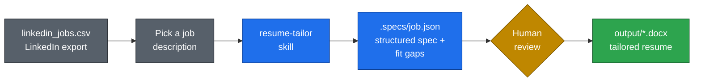

The repo ships two worked examples: specs and rendered docx files for an
Accenture Test Automation Lead and a Mouser Electronics Software QA Team Lead.

### Chapter 05: Job Tracker AI

A local-first kanban board for tracking job applications. Six columns from
Wishlist to Rejected, drag-and-drop between stages, all data stored in the
browser's IndexedDB so nothing leaves the machine.

#### Features

- Kanban board with six status columns: Wishlist, Applied, Follow-up, Interview, Offer, Rejected
- Drag-and-drop between columns via dnd-kit, with pointer and keyboard sensors
- Add/edit modal with company, role, LinkedIn URL, resume used, salary range, date applied, status, and notes
- Resume name autocomplete from previously used resumes
- Search by company or role, sort by newest or oldest applied date
- Header metrics: total jobs, interviews, offers
- JSON backup export and import (import replaces existing data after confirmation)
- Light/dark theme toggle persisted in localStorage
- Delete confirmation dialog, toast notifications, Escape-to-close modals

#### Tech stack

| Layer | Choice |
| --- | --- |
| UI | React 18 + Vite |
| Styling | Tailwind CSS 3 (`darkMode: 'class'`) |
| Drag and drop | @dnd-kit/core + @dnd-kit/sortable |
| Persistence | IndexedDB via `idb` |
| Icons | lucide-react |

#### Data model

Each job is one record in the `jobs` object store of the `job-tracker-ai`
IndexedDB database, keyed by `id`, indexed by `status` and `dateApplied`:

```js
{
  id: 'uuid',
  company: 'Accenture',
  role: 'Test Automation Lead',
  linkedInUrl: 'https://linkedin.com/jobs/...',
  resumeUsed: 'QA_Lead_Resume',
  dateApplied: '2026-08-23',
  salaryRange: '',
  notes: '',
  status: 'applied',   // wishlist | applied | follow-up | interview | offer | rejected
  createdAt: '...',
  updatedAt: '...',
}
```

#### Running the app

```bash
cd chapter_05_JobTrackerAI
npm install
npm run dev        # http://localhost:5173
```

#### State flow

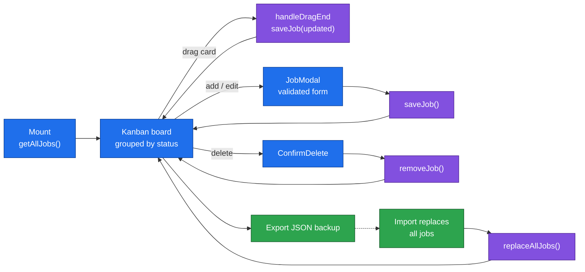

**Q&A - why use this?**
- **Q: When do I reach for it?** A: Any active job hunt where you are juggling more than a handful of applications across stages.
- **Q: What does it replace?** A: The spreadsheet. Status changes become a drag instead of a cell edit, and search plus metrics come free.
- **Q: What's the gotcha?** A: Data lives only in that browser's IndexedDB. Use Export before clearing site data or switching machines; import replaces everything.

### Chapter 06: Branding and LinkedIn Skills

A Claude/Codex skill that turns any content seed into a publish-ready pack in
The Testing Academy voice. Drop in a title, rough bullets, a screenshot, a URL,
a thread, or a spoken dump. The skill returns a Medium article, a LinkedIn post,
LinkedIn image prompts, and a Medium cover prompt.

The voice spec, deliverable formats, and a full worked example live in
[chapter_06_Branding_LinkedinSkills/README.md](chapter_06_Branding_LinkedinSkills/README.md).

#### What it produces

| File | Job |
| --- | --- |
| `pack-1-medium-article.md` | 2,500 to 3,200 word Medium draft |
| `pack-2-linkedin-post.md` | Hook ladder, 220 to 260 word post, first-comment blocks |
| `pack-3-linkedin-image-prompts.md` | Style C v2 tweet-screenshot cards |
| `pack-4-medium-image-prompt.md` | Style A 16:9 cyber infographic cover |

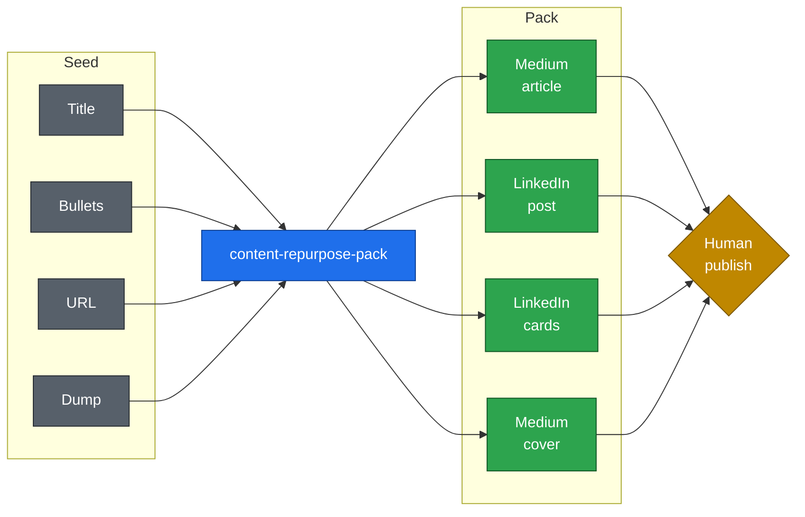

#### File structure

```
chapter_06_Branding_LinkedinSkills/
├── files.zip                         # original archive
├── content-repurpose-pack.skill      # packaged bundle
└── content-repurpose-pack/
    ├── SKILL.md                      # pipeline and hook protocol
    └── references/
        ├── brand-voice.md            # Hook / Story / Offer, 13 threads
        ├── deliverable-specs.md      # exact formats for the four files
        └── worked-example.md         # one full input-to-output pass
```

#### Install the skill

```bash
skill_source=chapter_06_Branding_LinkedinSkills/content-repurpose-pack
skill_destination="$HOME/.claude/skills/content-repurpose-pack"

if [ -e "$skill_destination" ]; then
  echo "Skill already exists; compare and back it up before an explicitly approved update."
  exit 1
fi

mkdir -p "$(dirname "$skill_destination")"
cp -R "$skill_source" "$skill_destination"
```

For Codex, use `$HOME/.codex/skills/content-repurpose-pack`. Then invoke it by
name, such as `$content-repurpose-pack`.

#### Pack pipeline

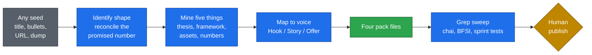

#### Voice spine

Same three beats on LinkedIn and Medium. Only the word budget changes. The usual
miss is a great Hook and Story with no Offer.


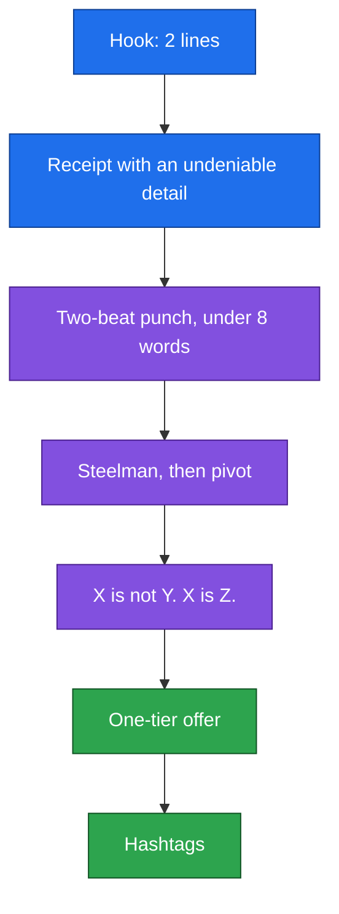

Offer rotation: four posts on a belief or a question, then one free asset, and a
product link only for real launches.

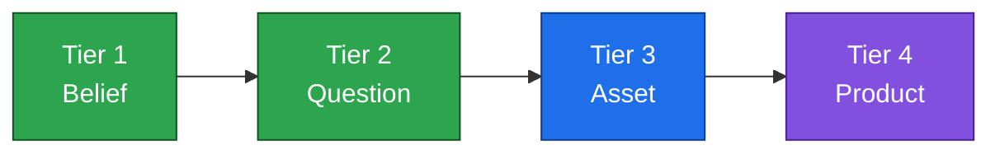

#### Hook ladder

When the ask is controversial, the skill returns three labelled variants instead
of sanitizing or refusing.

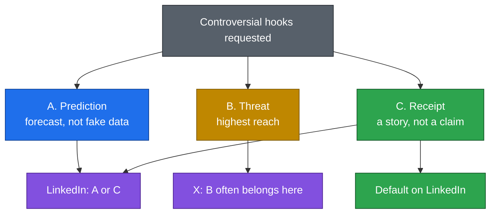

**Q&A - why use this?**
- **Q: When do I reach for it?** A: When a seed needs to become a Medium + LinkedIn + image pack in this voice, not a generic rewrite.
- **Q: What does it replace?** A: Re-prompting from scratch for length, banned phrases, first-comment splits, and image specs.
- **Q: What's the gotcha?** A: A pack with no receipt is the biggest quality drop. Supply a real story, or accept a composite flagged for anonymization. No em dashes, anywhere.

### Chapter 07: AI Agents

A **Test Plan Agent**: give it a Jira ID, get back a formal 14-section test plan
where every claim traces to a real field on the ticket. Built with the
**B.L.A.S.T.** protocol on the **A.N.T.** 3-layer architecture.

**Why:** the naive version (paste a ticket into a chat window, ask for a test plan)
hallucinates acceptance criteria, produces a different shape every run, and gives you
no way to tell which step went wrong when the output is bad.

**Q&A - why use this?**
- **Q: When do I reach for it?** A: When a story needs a review-ready test plan and you need every scope decision defensible to a reviewer.
- **Q: What does it replace?** A: Hand-writing the same 14 sections per ticket, and the re-prompting loop when a chat model drifts from your template.
- **Q: What's the gotcha?** A: It will refuse a thin ticket rather than invent one, returning a gap report instead. That is the design, not a bug: 2 of 4 real tickets were refused in testing.

#### The B.L.A.S.T. protocol

Five phases with hard gates. Nothing enters `tools/` until Discovery Questions are
answered, the data schema is frozen, and the blueprint is approved.

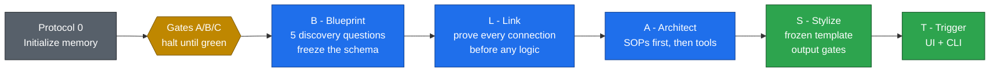

Four memory files carry the project state: `task_plan.md` (phases and checklists),
`findings.md` (research and constraints), `progress.md` (a timestamped log of what was
done, what errored, what the result was), and `LLM.md` (the constitution: schemas,
18 behavioural rules, 10 architectural invariants).

#### A.N.T. 3-layer architecture

The premise: **LLMs are probabilistic, business logic must be deterministic.** So the
pipeline is seven steps and exactly one of them calls a model.

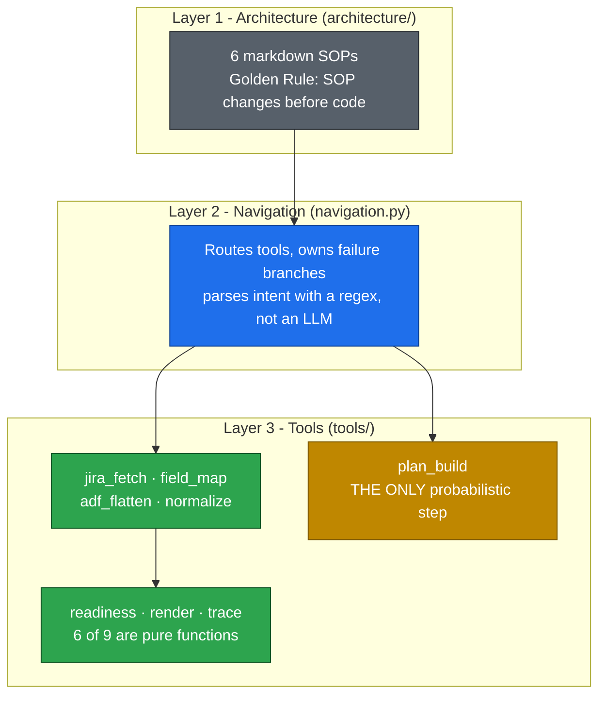

The pipeline, end to end:

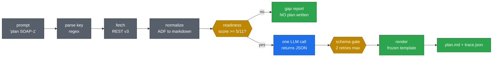

#### Running the agent

```bash
cd chapter_07_AI_Agents/Test-Plan-Agent-Blast
pip install -r requirements.txt
cp .env.example .env          # or use the Settings page
streamlit run app.py          # UI on :8501
```

Open **Settings** first: add the Jira URL, email and API token plus an LLM key
(DeepSeek or Groq, both OpenAI-compatible), then press both **Test connection**
buttons. The CLI mirrors the UI:

```bash
python run.py SOAP-1                    # generate a plan
python run.py "make a plan for VWO-49"  # natural language, same result
python run.py --health                  # prove both connections
python run.py --dry-run SOAP-1          # fetch + normalize, no LLM call
```

Exit codes: `0` ok, `2` bad input, `3` auth, `4` not found, `5` rate limited,
`6` schema violation, `7` LLM failure.

#### Anti-hallucination design

The model returns **JSON, not markdown**. `render.py` owns the format, so the model
never sees the template and cannot drift from it. Two schema fields do the real work:

```json
{
  "scope": [{
    "type": "Error Handling",
    "rationale": "Assert the 400 response names the offending field.",
    "justified_by": "FR-03: the system must reject requests missing sISBN."
  }],
  "assumptions": [{
    "field": "environment.url",
    "assumed_value": "QA environment (URL not specified in ticket)",
    "why": "Ticket does not provide a concrete environment URL"
  }]
}
```

`justified_by` is required on every scope entry and must name the ticket fact that put
it there. A model that cannot fill it has just admitted the entry is padding, and the
schema rejects the response. That turns "please do not hallucinate" from a hopeful
instruction into a structural constraint. Anything filled without ticket evidence lands
in `assumptions[]` and renders into the deliverable, not into a debug log.

#### Field notes from the build

Three findings that only surfaced by running it against a live Jira and a live model:

| Finding | Why it matters |
|---|---|
| **Jira answers 404, not 401**, on `/issue/{key}` when auth is bad | It hides issue existence from unauthenticated callers, so an expired token presents as a *missing ticket*. The fix is to call `/myself` on a 404 to disambiguate. |
| **Groq counts `max_tokens` against the TPM limit** | The reservation is billed, not the completion. A 2,669-token prompt with `max_tokens: 8000` reads as 10,669 against an 8,000 cap. Check the reservation before slimming the payload. |
| **`config.json` silently shadowed `.env`** | Saving credentials in the UI wrote them to `config.json`, which outranks `.env`, so later edits to `.env` were ignored with no indication. Settings now shows the source of every value. |

### Chapter 08: n8n Agents

Nine n8n workflows plus the prompt files that drive them. The chapter walks the same
Jira-agent idea from chapter 07 across a visual low-code canvas, then pushes past it
into multi-tool agents (Jira + Google Sheets), local models, a deterministic RCA
pipeline, a LinkedIn content chain, a scheduled poster that stops for human approval
before it publishes, a screenshot-to-bug-report intake, and a custom React UI
(`ui_screenshotbugAIAgent/`) deployed on Vercel that wraps workflow 09 behind a
branded, paste-friendly front end.

**Why:** an agent loop drawn on a canvas is legible to people who will not read a call
stack. It also makes the failure modes visible: you can see exactly where the LLM is
allowed to decide, and where a plain node does the work.

```
chapter_08_n8n/
├── 01_Raw_BugTriage.prompt.md        # the persona-only triage prompt (v1)
├── 02_ModifiedBugTriagePrompt.prompt.md  # v2: same persona + tool-calling contract
├── 03_RCA_AI_Agent.prompt.md         # the meta-prompt that generated workflow 05
├── Agents/
│   ├── 01_FetchJIRATicket_AIAgent.json   # 9 nodes: chat/schedule -> agent -> Jira get
│   ├── 02_CreateJIRATicket_AIAgent.json  # 9 nodes: same shape, Jira create
│   ├── 03_FetchJIRACreateTCAIAgent_Local_LLM_ollama.json  # 6 nodes: local Ollama / Groq brain
│   ├── 04_BugTriageAIAgent.json          # 12 nodes: Jira + Google Sheets, two tools
│   ├── 05_RCA_Chatgpt_Jira_Production_Bug_RCA_Automation.json  # 35 nodes: full RCA pipeline
│   ├── 06_Social_Media_AIAgent.json      # 15 nodes: topic -> post -> image -> review -> LinkedIn
│   ├── 07_Social_Post_Generator (Gemini+ Upload Post).json  # 14 nodes: scheduled post + Telegram approval
│   ├── 08_Screenshot_To_Bug_Reporter_AIAgent.json  # 11 nodes: screenshot -> vision -> Jira bug
│   ├── 09_Screenshot_To_Bug_Reporter_AIAgent_UI.json  # webhook variant for the custom UI
│   ├── Plan.md                       # model research + design notes for 08
│   ├── Prompt.md                     # the build prompt that produced 08 and 09
│   └── screenshot-bug-reporter-live-run.png  # a real run: VWO-125 filed from a login error
└── resources/
    ├── Jira_Bug_Triage_Sample.xlsx   # the triage sheet the agent writes into
    └── VWO-49_RCA.doc                # a sample RCA output
```

Import any file through **n8n > Workflows > Import from File**, then attach your own
credentials. n8n stores credentials by reference, so the exported JSON carries no secrets.
Workflow 07 is the one exception worth knowing about: it calls the Gemini image endpoint
through a raw HTTP Request node, so the key travels in a plain header parameter rather
than a credential. That value ships as the placeholder `YOUR_GEMINI_API_KEY`. Replace it
on import, or better, move it into a Header Auth credential (see the Q&A under 07).

#### The Jira agent pair (01, 02)

The starting shape: a trigger, a brain, a memory, and exactly one Jira tool. A chat
message like "fetch PROJ-12" or "raise a bug for the login page" becomes a real Jira
API call.

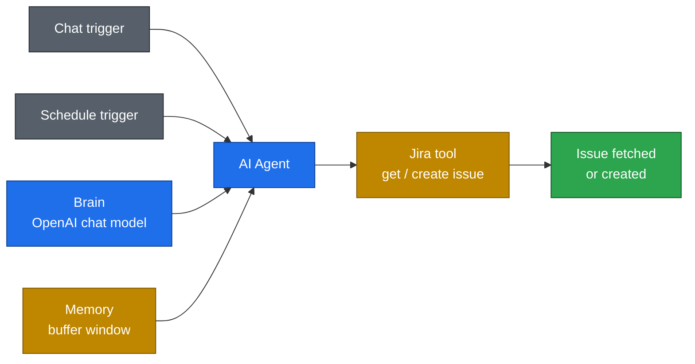

**Q&A - why use this?**
- **Q: When do I reach for it?** A: When the workflow should be editable by someone who does not write Python, or when it needs to run on a schedule without hosting your own app.
- **Q: What does it replace?** A: The glue code around auth, retries and scheduling.
- **Q: What's the gotcha?** A: The agent decides *when* to call the Jira tool, so a vague prompt can create the wrong ticket. Chapter 07's approach (deterministic fetch, one bounded LLM step) trades that flexibility for repeatability.

#### Swapping the brain: local Ollama and Groq (03)

The same fetch agent with the OpenAI node replaced. Two model nodes sit in the file:
an **Ollama Chat Model** (wired in, runs on your own machine) and a **Groq Chat Model**
(parked, swap the connection to use it). Memory is dropped, so the run is stateless.

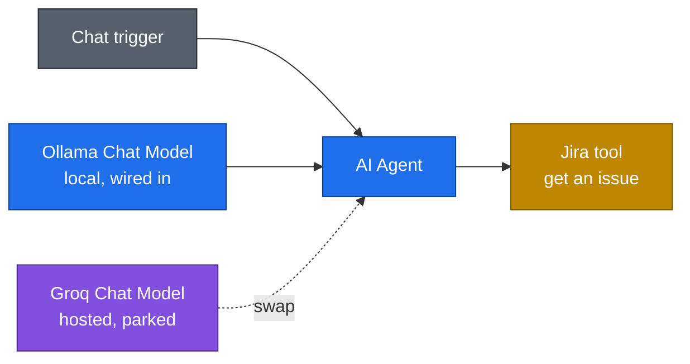

**Q&A - why use this?**
- **Q: Why bother running locally?** A: Ticket text is company data. A local model keeps it on your machine, and the token bill goes to zero.
- **Q: What breaks?** A: Small local models are weaker at tool calling. They will describe the Jira call instead of making it. Groq is the middle ground: hosted and fast, but still not OpenAI-grade at multi-step tool use.
- **Q: How do I decide?** A: Start on a hosted model to prove the workflow, then downgrade the brain and see if the tool calls survive.

#### Bug triage into Google Sheets (04)

The first genuinely multi-tool agent: it reads **many** Jira issues, triages each one,
and writes a row per issue into a Google Sheet keyed on `jira_key`. Four brains are
present in the file (OpenAI wired in, Groq and DeepSeek parked) so you can A/B the
triage quality on the same prompt.

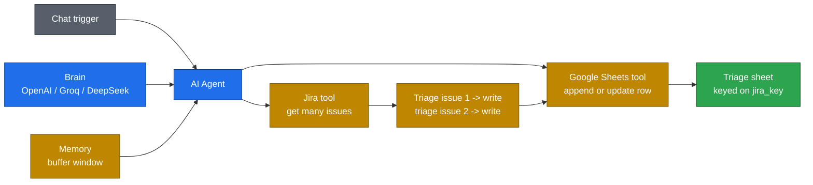

The two prompt files next to it are the interesting part, because they are the same
prompt one revision apart:

| | `01_Raw_BugTriage.prompt.md` | `02_ModifiedBugTriagePrompt.prompt.md` |
|---|---|---|
| Length | 72 lines | 370 lines |
| Covers | Persona, severity vs priority, S0-S4 and P0-P4 scales, category taxonomy, triage checklist, rules of the desk | All of that, **plus** the tool contract |
| Missing | Any mention of the tools | - |
| Adds | - | Mandatory execution order, pagination and dedup rules, per-issue write loop, column-by-column sheet mapping, sheet-tool error handling, final summary format |

Version 1 produces excellent triage *as text*. It does not reliably call Google Sheets,
because nothing in it says the agent must. Version 2 keeps the judgment intact and bolts
on the execution contract: retrieve, triage one, **write one**, repeat, and never invent
a Jira issue.

**Q&A - why use this?**
- **Q: What is the actual lesson?** A: A great persona prompt is not an agent prompt. The moment tools enter, you have to spell out the call order, the loop granularity, and what counts as success.
- **Q: Why write one row at a time?** A: Batching at the end means one failure loses the whole run. Per-issue writes make a partial run still useful.
- **Q: Why is `jira_key` the match column?** A: It makes the write idempotent. Re-running updates rows instead of duplicating them.

#### Production bug RCA pipeline (05)

The largest workflow in the repo: 35 nodes that turn a Jira production-bug event into a
formatted RCA workbook in Google Drive, as both a Google Sheet and an `.xlsx` export.

The architectural rule is the opposite of workflow 04. Jira, Drive and Sheets are **not**
agent tools here. They are plain deterministic nodes. The AI Agent does exactly one job:
turn the evidence package into structured RCA JSON, validated by an output parser.

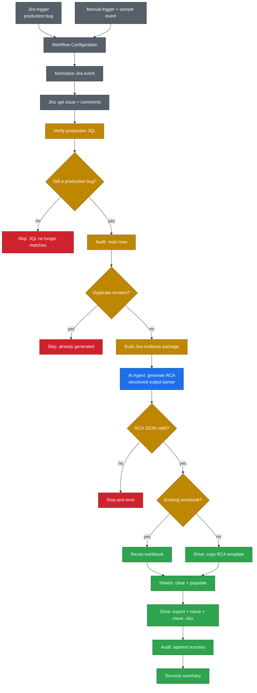

Three guards run before a single token is spent: the JQL re-check (the label may have
been removed since the trigger fired), the audit-table dedup (same issue, same revision,
already done), and the structured-output validation (a malformed RCA stops the run
instead of writing garbage into the template).

`03_RCA_AI_Agent.prompt.md` is the 1019-line meta-prompt that produced this workflow. It
specifies the config Set node, the template requirement, every node in the required
workflow, the RCA agent system prompt, the structured output schema, the human review
rule, and the acceptance tests. The workflow JSON is the output; the prompt is the spec.

**Q&A - why use this?**
- **Q: Why not let the agent call Jira and Sheets itself, like workflow 04?** A: Because an RCA writes into a shared template that people sign off on. You do not want the model deciding whether to copy a file. Agentic where judgment is needed, deterministic everywhere else.
- **Q: What does the audit table buy me?** A: Idempotency. Jira fires on every update; without the audit row you would generate a fresh RCA workbook on every comment.
- **Q: Why copy a template instead of building the sheet?** A: The template carries formatting, formulas, dropdowns and named worksheets. Copying preserves all of it; generating from scratch loses it.

#### Social media content chain (06)

Two independent pipelines in one file, both on schedule triggers. The main chain is a
sequence of specialised agents rather than one agent with many tools:

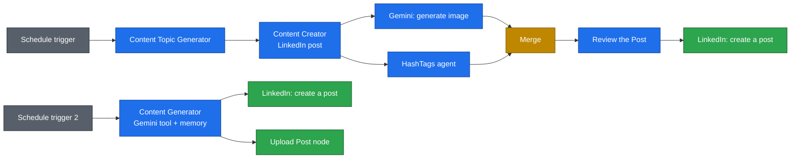

**Q&A - why use this?**
- **Q: Why five agents instead of one?** A: Each one has a single job and a short prompt, so you can read its output and fix the one that is wrong. A single mega-agent asked to pick a topic, write, illustrate, tag and review will quietly do the last step badly.
- **Q: What is the Review node for?** A: It is the quality gate before anything reaches a real audience. Swap it for a manual approval node if you are not ready to auto-post.
- **Q: How does this relate to chapter 06?** A: Chapter 06 is the voice and hook system as a Claude skill. This is the same idea running unattended on a schedule.

#### Scheduled post generator with human approval (07)

**Concept:** a fully unattended LinkedIn poster that runs every morning at 10:00, writes
the post, generates its own illustration, and then **stops** and asks a human on Telegram
to approve before anything is published.

**Why:** workflow 06 gates its output with another agent. An LLM reviewing an LLM catches
tone problems but will never catch the one that matters, which is a post you simply did
not want to go out under your name. This chain puts a person in that seat without
re-introducing the manual work of writing.

Two vendors sit in one chain on purpose. Gemini Flash picks the topic (cheap, high volume,
low stakes) and GPT writes the post (the step whose quality you actually feel). The image
comes from the Gemini image endpoint via a raw HTTP Request node, is converted to a binary
PNG, and rides along as the LinkedIn share media.

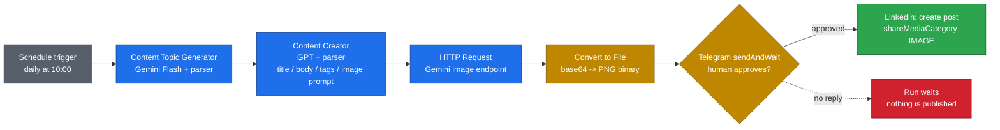

The whole gate is one node. `sendAndWait` suspends the execution and resumes it only when
the reply arrives, so no approval means no post rather than a default-yes:

```json
{
  "name": "Send a text message",
  "type": "n8n-nodes-base.telegram",
  "parameters": {
    "operation": "sendAndWait",
    "chatId": "859100842",
    "message": "={{ $('Content Creator (Linkedin Post)').item.json.output.post_body }}"
  }
}
```

```json
{
  "name": "Create a post",
  "type": "n8n-nodes-base.linkedIn",
  "parameters": {
    "text": "={{ $('Content Creator (Linkedin Post)').item.json.output.post_body }}",
    "shareMediaCategory": "IMAGE",
    "additionalFields": {
      "title": "={{ $('Content Creator (Linkedin Post)').item.json.output.post_title }}",
      "visibility": "PUBLIC"
    }
  }
}
```

| | 06: agent review | 07: human approval |
|---|---|---|
| Gate | `Review the Post` agent | Telegram `sendAndWait` |
| Blocks on | Model judgment | A real reply |
| Failure mode | Approves a bad post confidently | Nothing posts until you answer |
| Use when | Volume matters more than any single post | Your name is on it |

**Q&A - why use this?**
- **Q: Why `sendAndWait` instead of a Telegram send plus an IF node?** A: `sendAndWait` parks the execution and resumes on reply. A plain send would fire the message and continue straight into the LinkedIn node, which is exactly the thing the gate exists to prevent.
- **Q: Why does the image go through an HTTP Request node instead of the Gemini node?** A: The image endpoint returns base64 inside a nested `steps[1].content[0].data` path, so the response needs a `Convert to File` step to become the PNG binary LinkedIn wants. That also means the key lives in a header parameter, not a credential. Swap `YOUR_GEMINI_API_KEY` for a **Header Auth** credential (`authentication: genericCredentialType`) if you would rather it never touched the JSON.
- **Q: What's the gotcha?** A: The topic-generator's output parser is set to `manual` with no schema, so the second agent's prompt reads `$json.output.properties.topic.type` and picks up the literal string `"string"` out of the JSON Schema envelope instead of the topic. Fill in the first parser's `inputSchema` (as the second one does) and the expression shortens to `$json.output.topic`. It is a good illustration of the real hazard in visual pipelines: a wrong expression does not crash, it quietly feeds plausible garbage forward.

#### Screenshot to bug reporter (08)

**Concept:** a hosted upload form takes a screenshot plus optional error logs, a vision
model drafts a complete structured bug report from what it can actually see, and the
workflow files it into Jira with the original PNG attached to the ticket.

**Why:** the visual detail is the part testers summarise away. The red banner, the
overlapping div, the truncated error string: all of it is in the screenshot and almost
none of it survives being retyped into a ticket by hand.

This is the first workflow in the chapter with a **human file-upload intake**. Nothing in
01-07 ingests a user-supplied file, and the string `base64` appears nowhere else in the
chapter.

```mermaid
flowchart LR
    FT["Form trigger<br/>screenshot + logs"] --> NI["Normalize intake<br/>resolve binary, build prompts"]
    NI --> B64["Extract from file<br/>binary to base64"]
    B64 --> GV["Groq vision<br/>qwen3.6-27b, JSON mode"]
    GV --> PB["Parse bug report<br/>validate + render description"]
    PB --> JC["Jira: create bug<br/>VWO / Bug"]
    JC --> PA["Prepare attachment<br/>re-attach binary"]
    PA --> JA["Jira: add attachment<br/>screenshot on the ticket"]

    classDef src fill:#57606a,stroke:#24292f,color:#fff
    classDef ai fill:#1f6feb,stroke:#0b3d91,color:#fff
    classDef gate fill:#bf8700,stroke:#7a5600,color:#fff
    classDef out fill:#2da44e,stroke:#0f5323,color:#fff
    class FT src
    class GV ai
    class NI,B64,PB,PA gate
    class JC,JA out
```

Note what is **not** here: no AI Agent node. The model gets exactly one bounded job, and
every other step is a plain deterministic node. This is workflow 05's shape, not workflow
01's. An agent node would also hand the tool-calling loop the decision of whether to look
at the image at all.

The whole model call is one HTTP node, and the key never enters the file:

```json
{
  "method": "POST",
  "url": "https://api.groq.com/openai/v1/chat/completions",
  "authentication": "predefinedCredentialType",
  "nodeCredentialType": "groqApi",
  "jsonBody": "={{ JSON.stringify({ model: 'qwen/qwen3.6-27b', response_format: { type: 'json_object' }, messages: [ { role: 'system', content: $('Normalize Intake').first().json.system_prompt }, { role: 'user', content: [ { type: 'text', text: $('Normalize Intake').first().json.user_prompt }, { type: 'image_url', image_url: { url: 'data:' + $('Normalize Intake').first().json.mime_type + ';base64,' + $json.screenshot_b64 } } ] } ] }) }}"
}
```

`Agents/Plan.md` carries the full model research. The short version is that Groq's vision
lineup contracted through 2026: `llama-3.2-11b-vision` was decommissioned and Llama 4
Scout and Maverick left the supported list, so the only image-capable models left are
`qwen/qwen3.6-27b` and `qwen/qwen3.8-27b`, both Preview.

| | Groq `qwen3.6-27b` | OpenRouter `glm-5.3-flash` |
|---|---|---|
| Input / output per M | $0.60 / $3.00 | $0.075 / $0.25 |
| Per bug report | ~$0.0036 | ~$0.0004 |
| Status | Preview | Production |
| JSON | `response_format` honoured | No server-side schema enforcement |
| Pick it for | Speed | Cost, and stability |

**Q&A - why use this?**
- **Q: Why is the binary re-attached twice?** A: Because it does not survive the HTTP hop, and Jira's create response carries none either. Nodes 5 and 7 both pull it back from `$('Normalize Intake').first().binary`. Forgetting this is the single most common way a file-handling n8n workflow silently posts a ticket with no attachment.
- **Q: Why resolve the uploaded file by `Object.keys(item.binary)[0]` instead of by name?** A: The Form Trigger derives the binary property name from the field label, and the exact form has changed between n8n versions. Taking the first key and re-keying it to a stable `screenshot` property means the rest of the workflow depends on our name, not n8n's.
- **Q: What's the gotcha?** A: A vision model asked for a bug report will always produce one. Upload a screenshot of a perfectly healthy page and a careless prompt invents a defect to fill the schema. The system prompt therefore forbids inventing anything not visible and requires a `confidence` field, and that unbroken-page run is the test worth doing first.

#### Screenshot to bug reporter UI (09)

**Concept:** a custom React front end for workflow 08, deployed on Vercel. Upload a
screenshot (or Ctrl+V paste it from the clipboard), the UI sends it through a serverless
proxy to the n8n webhook, and the resulting Jira ticket link appears in the browser.

**Why:** the n8n Form Trigger (workflow 08) serves n8n's own hosted upload page. It works
but it is not branded, not paste-friendly, and not something you would show a stakeholder.
This UI wraps the same webhook behind a polished, The Testing Academy-themed intake.

```mermaid
flowchart LR
    B["Browser<br/>paste or upload"] -->|"POST /api/report"| V["Vercel serverless<br/>proxy"]
    V -->|"multipart/form-data"| N8N["n8n webhook<br/>workflow 09"]
    N8N --> GV["Groq vision<br/>qwen3.6-27b"]
    GV --> JC["Jira: create bug"]
    JC --> JA["Jira: attach screenshot"]
    JA -->|"ticket link"| B

    classDef src fill:#57606a,stroke:#24292f,color:#fff
    classDef ai fill:#1f6feb,stroke:#0b3d91,color:#fff
    classDef gate fill:#bf8700,stroke:#7a5600,color:#fff
    classDef out fill:#2da44e,stroke:#0f5323,color:#fff
    class B src
    class GV ai
    class V,N8N gate
    class JC,JA out
```

The browser never talks to n8n directly. The proxy kills the CORS problem (same-origin
request) and keeps the webhook URL out of client-side code, where anyone could read it
from devtools and POST to it.

```js
// api/report.js — the serverless proxy
export default async function handler(req, res) {
  const target = process.env.N8N_WEBHOOK_URL;
  if (!target) {
    return res.status(503).json({ ok: false, error: 'N8N_WEBHOOK_URL is not set.' });
  }
  const rawBody = await readRawBody(req);
  const upstream = await fetch(target, {
    method: 'POST',
    headers: { 'content-type': req.headers['content-type'] },
    body: rawBody,
  });
  const data = await upstream.json();
  return res.status(upstream.status).json(data);
}
```

**Q&A - why use this?**
- **Q: When do I reach for it?** A: When the n8n Form Trigger is not enough and you want a branded, paste-friendly intake that a stakeholder would use.
- **Q: What does the proxy buy me?** A: The browser makes a same-origin POST to `/api/report`. No CORS preflight, no webhook URL in devtools, and the function can reject oversized payloads before they reach n8n.
- **Q: What's the gotcha?** A: The proxy times out at 55s (Vercel hobby plan). A slow Groq run plus two Jira calls can take 15-30s, so it fits, but a cold start plus a slow model run can push past it. The UI shows a five-stage progress indicator so the user sees it is working, not stuck.

#### Screenshot to bug reporter UI (09)

**Concept:** workflow 08 with its Form Trigger swapped for a **Webhook** and a **Respond to
Webhook** node bolted on the end, so a custom front end can call it as a JSON API and get
the filed ticket back instead of an n8n-hosted HTML page.

**Why:** an n8n form is fine for a demo, but the moment you want your own branding, a paste
-from-clipboard upload, or the Jira key rendered back to the reporter, you need a real API
and a real UI in front of it.

The front end lives in [`ui_screenshotbugAIAgent/`](ui_screenshotbugAIAgent/) (Vite + React
+ Tailwind) and is deployed on Vercel. A real run, end to end:

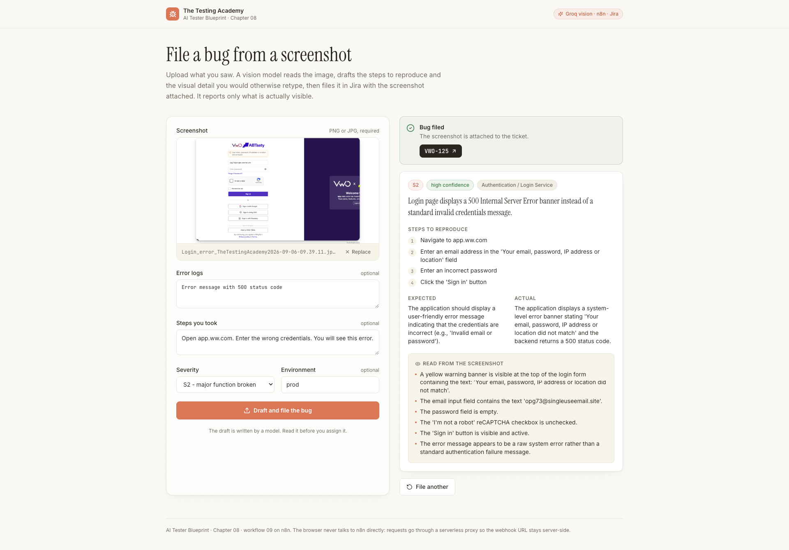

Note what the model read off that screenshot: the exact banner text, the email in the input
(`opg73@singleuseemail.site`), the empty password field, the unchecked reCAPTCHA. That is
the detail a tester would never retype by hand.

```mermaid
flowchart LR
    UI["Vercel UI<br/>paste or drop a screenshot"] --> PX["/api/report<br/>serverless proxy"]
    PX --> WH["n8n Webhook<br/>POST screenshot-bug-report"]
    WH --> NI["Normalize intake"]
    NI --> GV["Groq vision<br/>qwen3.8-27b, JSON mode"]
    GV --> JC["Jira: create + attach"]
    JC --> RW["Respond to Webhook<br/>jira_key, summary, confidence"]
    RW --> UI

    classDef src fill:#57606a,stroke:#24292f,color:#fff
    classDef ai fill:#1f6feb,stroke:#0b3d91,color:#fff
    classDef gate fill:#bf8700,stroke:#7a5600,color:#fff
    classDef out fill:#2da44e,stroke:#0f5323,color:#fff
    class UI src
    class GV ai
    class PX,WH,NI gate
    class JC,RW out
```

The browser never calls n8n. It posts to a same-origin serverless function, which forwards
the raw multipart body server-side:

```js
// ui_screenshotbugAIAgent/api/report.js
export const config = { api: { bodyParser: false } };  // keep the multipart boundary intact

export default async function handler(req, res) {
  const target = process.env.N8N_WEBHOOK_URL;          // never reaches the browser
  const chunks = [];
  for await (const chunk of req) chunks.push(chunk);

  const upstream = await fetch(target, {
    method: 'POST',
    headers: { 'content-type': req.headers['content-type'] },
    body: Buffer.concat(chunks),
  });
  return res.status(200).json(JSON.parse(await upstream.text()));
}
```

**Q&A - why use this?**
- **Q: Why a proxy instead of calling n8n from the browser?** A: Two reasons. CORS, which a same-origin request sidesteps entirely, and secrecy: a webhook URL in client-side JavaScript is readable in devtools, and anyone who finds it can file tickets into your project.
- **Q: Why does `bodyParser` have to be off?** A: The payload is `multipart/form-data` carrying an image. Parsing and re-serialising it destroys the boundary, and n8n then receives no file. Forward the raw bytes and set `content-type` from the incoming request.
- **Q: What's the gotcha?** A: The `/form/<uuid>` URL n8n shows you belongs to the **Form Trigger** and serves HTML. Workflow 09 uses a Webhook node, so its address is `/webhook/screenshot-bug-report`. Point the proxy at the form URL and it half-works in the worst way: the bug gets filed, but the reply is an HTML page, so the UI reports a non-JSON response and you never see the key.

#### The failure worth teaching

The first live run submitted a screenshot of a **perfectly healthy page**. The model
returned `"confidence": "high"` and invented a layout defect, claiming the heading was
truncated to "File a bug from a screens". None of it was in the image.

The cause was the prompt, in two places:

| Mistake | Fix |
|---|---|
| The task framing presupposed a bug: "Analyze the screenshot and **draft the bug report**" | Reframed so the **first** instruction is to decide whether a defect exists at all, with "Nothing is wrong here" named as a correct answer |
| The reporter's severity hint (`S4 - cosmetic`) primed it, and it duly found a cosmetic issue | Told explicitly that the severity guess is not evidence, and neither is being asked for a report |

**A generator asked for X will produce X.** If "nothing to report" is a valid outcome, the
prompt has to make it an explicit first-class branch, not a caveat buried in a rule list.
Which is why the negative case, uploading a screenshot of a normal page and expecting low
confidence, is the **first** test to run after any prompt or model change, not the last.

#### Cross-chapter takeaway

Workflows 01-04 and 06 are **agentic**: the model chooses which tool to call. Workflows 05,
07, 08 and 09 are **deterministic with bounded LLM steps**, the same shape as chapter 07's
B.L.A.S.T. agent. The chapter is arranged so you feel the difference: agentic is faster to build and
easier to demo, deterministic is what survives contact with a template your team signs off on.

### Chapter 09: LangFlow

**Concept:** LangFlow is a visual low-code canvas for building AI pipelines, similar to
n8n but purpose-built for LLM workflows. Drag nodes onto a canvas, connect them, and
export a runnable Python pipeline or a JSON file.

**Why:** n8n is general-purpose automation. LangFlow is LLM-native: vector stores,
prompt templates, chains, agents, and retrievers are first-class nodes, not HTTP
workarounds. It is the tool you reach for when the pipeline is mostly AI reasoning
rather than API orchestration.

```mermaid
flowchart LR
    INSTALL["pip install langflow"] --> RUN["langflow run"]
    RUN --> UI["Web UI on :7860"]
    UI --> CANVAS["Drag nodes<br/>connect pipeline"]
    CANVAS --> EXPORT["Export as Python<br/>or JSON"]
    EXPORT --> DEPLOY["Run anywhere<br/>or host as API"]

    classDef src fill:#57606a,stroke:#24292f,color:#fff
    classDef ai fill:#1f6feb,stroke:#0b3d91,color:#fff
    classDef out fill:#2da44e,stroke:#0f5323,color:#fff
    class INSTALL,RUN src
    class UI,CANVAS ai
    class EXPORT,DEPLOY out
```

```bash
# Quick start
mkdir langflow-qa && cd langflow-qa
python3 -m venv venv
source venv/bin/activate
pip install langflow
langflow run          # opens http://localhost:7860
```

**Q&A - why use this?**
- **Q: When do I reach for LangFlow over n8n?** A: When the pipeline is mostly LLM reasoning (chains, RAG, agents) rather than API orchestration. LangFlow's vector-store and retriever nodes are native; n8n's are HTTP calls.
- **Q: What does it replace?** A: Hand-writing LangChain Python scripts and debugging chain wiring in code. The canvas makes the flow visible.
- **Q: What's the gotcha?** A: LangFlow is a development tool, not a production scheduler. For scheduled, unattended runs with approval gates, n8n (chapter 08) is the better fit.

## License

MIT
