# AITester Blueprint 4x

AI-powered test automation blueprint.

## Contents

- [Overview](#overview)
- [Chapters](#chapters)
  - [Chapter 01: LLM Basics](#chapter-01-llm-basics)
  - [Chapter 02: Prompt Engineering](#chapter-02-prompt-engineering)
    - [The 54-skill QA prompt suite](#the-54-skill-qa-prompt-suite)
    - [Install a skill](#install-a-skill)
  - [Chapter 03: Local Test Case Generator](#chapter-03-local-test-case-generator)
    - [Features](#features)
    - [File structure](#file-structure)
    - [Running the app](#running-the-app)
    - [Environment variables](#environment-variables)
    - [Data flow](#data-flow)
  - [Chapter 04: JobKit AI](#chapter-04-jobkit-ai)
  - [Chapter 05: Job Tracker AI](#chapter-05-job-tracker-ai)
    - [Features](#features-1)
    - [Tech stack](#tech-stack)
    - [Data model](#data-model)
    - [Running the app](#running-the-app-1)
    - [State flow](#state-flow)
  - [Chapter 06: Branding and LinkedIn Skills](#chapter-06-branding-and-linkedin-skills)
    - [What it produces](#what-it-produces)
    - [File structure](#file-structure-1)
    - [Install the skill](#install-the-skill)
    - [Pack pipeline](#pack-pipeline)
    - [Voice spine](#voice-spine)
    - [Hook ladder](#hook-ladder)
  - [Chapter 07: AI Agents](#chapter-07-ai-agents)
    - [The B.L.A.S.T. protocol](#the-blast-protocol)
    - [A.N.T. 3-layer architecture](#ant-3-layer-architecture)
    - [Running the agent](#running-the-agent)
    - [Anti-hallucination design](#anti-hallucination-design)
    - [Field notes from the build](#field-notes-from-the-build)
  - [Chapter 08: n8n Agents](#chapter-08-n8n-agents)
    - [The Jira agent pair (01, 02)](#the-jira-agent-pair-01-02)
    - [Swapping the brain: local Ollama and Groq (03)](#swapping-the-brain-local-ollama-and-groq-03)
    - [Bug triage into Google Sheets (04)](#bug-triage-into-google-sheets-04)
    - [Production bug RCA pipeline (05)](#production-bug-rca-pipeline-05)
    - [Social media content chain (06)](#social-media-content-chain-06)
    - [Scheduled post generator with human approval (07)](#scheduled-post-generator-with-human-approval-07)
    - [Screenshot to bug reporter (08)](#screenshot-to-bug-reporter-08)
    - [Screenshot to bug reporter UI (09)](#screenshot-to-bug-reporter-ui-09)
    - [Cross-chapter takeaway](#cross-chapter-takeaway)
  - [Chapter 09: LangFlow](#chapter-09-langflow)
    - [The bug triage flows](#the-bug-triage-flows)
    - [Calling a flow from your own UI](#calling-a-flow-from-your-own-ui)
  - [Chapter 10: RAG Basics](#chapter-10-rag-basics)
    - [The five stages](#the-five-stages)
    - [The step everyone skips](#the-step-everyone-skips)
    - [Running it two ways](#running-it-two-ways)
  - [Chapter 11: RAG Implementation](#chapter-11-rag-implementation)
    - [Two workflows, one lesson](#two-workflows-one-lesson)
    - [Why one document per row](#why-one-document-per-row)
  - [Chapter 12: QABuddy, Hybrid RAG for QA](#chapter-12-qabuddy-hybrid-rag-for-qa)
    - [Five decisions](#five-decisions)
    - [Hybrid retrieval, measured](#hybrid-retrieval-measured)
    - [Top-k cannot prove absence](#top-k-cannot-prove-absence)
  - [Chapter 14: MCP Servers by Vibe Coding](#chapter-14-mcp-servers-by-vibe-coding)
    - [Data first, then tools](#data-first-then-tools)
    - [The 21 tools](#the-21-tools)
    - [Connect from any MCP client](#connect-from-any-mcp-client)
    - [Sharing it with students over a tunnel](#sharing-it-with-students-over-a-tunnel)
    - [TestSkill Finder MCP: 100 QA skills for any LLM](#testskill-finder-mcp-100-qa-skills-for-any-llm)
    - [How skill search works](#how-skill-search-works)
    - [Files in this chapter](#files-in-this-chapter)
  - [Chapters 13 and 15-21: coming next](#chapters-13-and-15-21-coming-next)
- [License](#license)

## Overview

AITester Blueprint 4x Where we will learn about a lot of things related to:
- AI Agent
- MCPs
- RAG
- LLM evaluations
- Langchain
- Langflow
- ATAN
- and many more things which will make us the AI-powered tester

## Chapters

### Chapter 01: LLM Basics
Foundation concepts of Large Language Models and AI fundamentals.

### Chapter 02: Prompt Engineering

RICE-POT template framework for structured prompt engineering, a Salesforce Selenium test
framework built with the Page Object Model pattern, and a
[54-skill QA prompt suite](chapter_02_Prompt_Eng/prompt_templates/README.md).

#### The 54-skill QA prompt suite

Every skill is a folder holding a `SKILL.md` with YAML frontmatter, so it drops straight into
`~/.claude/skills/` or `~/.codex/skills/` and is invoked by name. 36 skills come from
[skillmasterclass](https://github.com/PramodDutta/skillmasterclass/tree/d8c5108d5ae524b10a5a1c695cdee8cfc018be7b/skillmasterclass/skills)
and are hardened here for credential handling, execution authorization, network isolation, and
evidence redaction. 18 are new: API testing, AI safety and guardrails, and test deliverables.

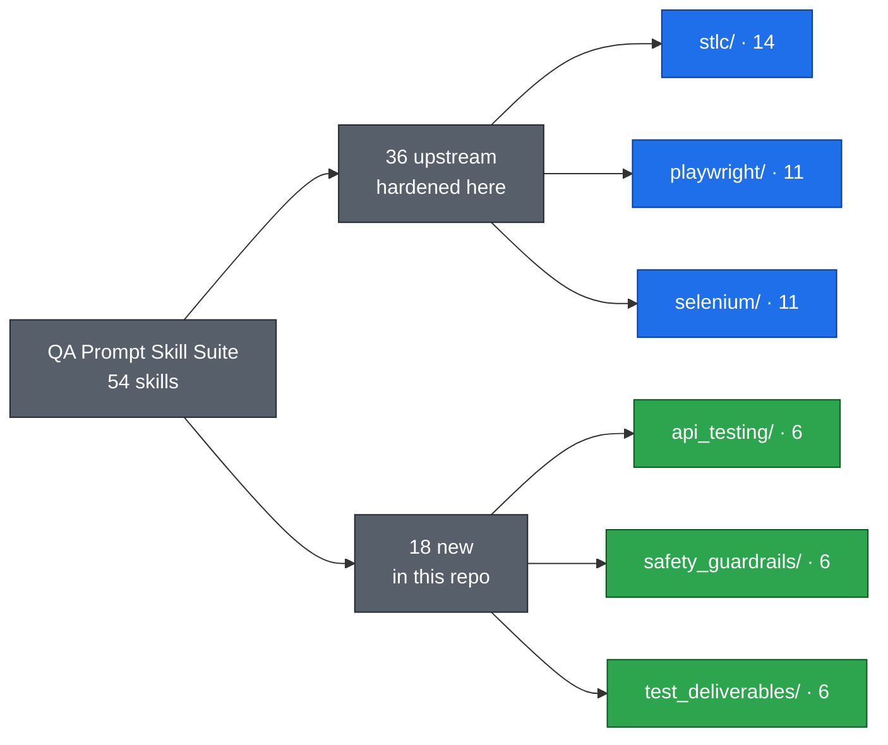
```mermaid
flowchart LR
    S["QA Prompt Skill Suite<br/>54 skills"]

    S --> U["36 upstream<br/>hardened here"]
    S --> N["18 new<br/>in this repo"]

    U --> A["stlc/ · 14"]
    U --> B["playwright/ · 11"]
    U --> C["selenium/ · 11"]
    N --> D["api_testing/ · 6"]
    N --> E["safety_guardrails/ · 6"]
    N --> F["test_deliverables/ · 6"]

    classDef root fill:#57606a,stroke:#24292f,color:#fff
    classDef core fill:#1f6feb,stroke:#0b3d91,color:#fff
    classDef ext fill:#2da44e,stroke:#0f5323,color:#fff
    class S,U,N root
    class A,B,C core
    class D,E,F ext
```

Where each group plugs into the lifecycle:

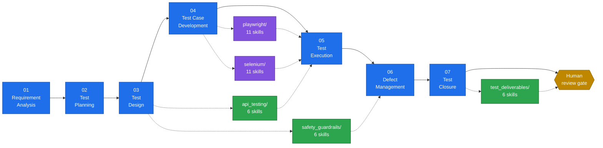
```mermaid
flowchart LR
    P1["01<br/>Requirement<br/>Analysis"] --> P2["02<br/>Test<br/>Planning"] --> P3["03<br/>Test<br/>Design"] --> P4["04<br/>Test Case<br/>Development"] --> P5["05<br/>Test<br/>Execution"] --> P6["06<br/>Defect<br/>Management"] --> P7["07<br/>Test<br/>Closure"] --> GATE{{"Human<br/>review gate"}}

    P3 -.-> API["api_testing/<br/>6 skills"]
    P3 -.-> SAFE["safety_guardrails/<br/>6 skills"]
    P4 -.-> PW["playwright/<br/>11 skills"]
    P4 -.-> SE["selenium/<br/>11 skills"]
    API -.-> P5
    PW -.-> P5
    SE -.-> P5
    SAFE -.-> P6
    P7 -.-> DEL["test_deliverables/<br/>6 skills"]
    DEL -.-> GATE

    classDef core fill:#1f6feb,stroke:#0b3d91,color:#fff
    classDef pack fill:#8250df,stroke:#4a1f8f,color:#fff
    classDef ext fill:#2da44e,stroke:#0f5323,color:#fff
    classDef gate fill:#bf8700,stroke:#7a5600,color:#fff
    class P1,P2,P3,P4,P5,P6,P7 core
    class PW,SE pack
    class API,SAFE,DEL ext
    class GATE gate
```

Nothing in the suite is self-approving. Skills report only what the supplied evidence supports,
mark anything unverified as unknown rather than assuming it passed, and stop at a human review
gate before a plan, case set, defect, report, or release decision counts as final.

<details>
<summary><b>STLC · 14 skills</b>: requirement analysis through test closure</summary>

| Skill | What it does |
| --- | --- |
| `jira-requirement-analyzer` | Score a JIRA ticket against a readiness checklist, return gaps, ambiguities, risks, and clarifying questions |
| `test-plan-generator` | Fetch a ticket and fill the standard test plan template, stopping for human review |
| `test-scenario-designer` | Derive positive, negative, boundary, and cross-role scenarios traced to each acceptance criterion |
| `api-test-designer` | Map endpoint or contract coverage across happy path, schema, auth, negative, boundary, and idempotency |
| `test-case-writer` | Expand approved scenarios into preconditions, ordered steps, expected results, and required data |
| `test-data-generator` | Produce labeled valid, invalid, boundary, and synthetic data sets per field or scenario |
| `automation-script-generator` | Framework-neutral handoff for an approved case, plus a Playwright versus Selenium stack decision |
| `test-execution-tracker` | Record pass, fail, blocked, or not-run per case with evidence, then roll up cycle progress |
| `regression-suite-selector` | Map a change to the tests that exercise it and rank a risk-based run set |
| `bug-reporter` | Turn an observed failure into a structured, reproducible defect report |
| `bug-triage-assistant` | Group likely duplicates, propose severity and priority, and route a defect backlog |
| `rca-analyzer` | Run 5-Whys plus fishbone to separate root cause from symptom and propose corrective actions |
| `test-coverage-analyzer` | Build a traceability view and surface untested ACs, thin areas, and orphan tests |
| `test-closure-reporter` | Roll cycle metrics into highlights, risks, and an advisory go or no-go |

</details>

<details>
<summary><b>Playwright · 11 skills</b>: TypeScript automation pack</summary>

| Skill | What it does |
| --- | --- |
| `pw-test-generator` | Generate a TypeScript spec from an approved, detailed test case |
| `pw-page-object-builder` | Build a POM class with `getByRole` / `getByTestId` locators, action methods, and a static `PATH` |
| `pw-locator-fixer` | Rewrite brittle XPath, CSS class, and nth-child selectors into resilient ones with a before and after map |
| `pw-fixture-designer` | Design typed auth, seeded-data, and page-object fixtures with correct scope and teardown |
| `pw-network-mocker` | Stub responses and error states via `page.route` to remove backend flakiness |
| `pw-api-tester` | Cover an endpoint through the request context: happy path, schema, auth, negative, boundary |
| `pw-visual-regression` | Set up `toHaveScreenshot` with masking, thresholds, and a baseline strategy |
| `pw-accessibility-auditor` | Wire `@axe-core/playwright` checks and triage violations against a supplied policy |
| `pw-trace-analyzer` | Read a `trace.zip` timeline to isolate the failing action and recommend the fix |
| `pw-flaky-debugger` | Root-cause races, hard waits, and shared state, then propose deterministic fixes |
| `pw-ci-configurator` | Generate a GitHub Actions workflow with sharding, blob and HTML reports, and artifacts |

</details>

<details>
<summary><b>Selenium · 11 skills</b>: Java, TestNG, Maven automation pack</summary>

| Skill | What it does |
| --- | --- |
| `se-test-generator` | Generate a Selenium 4 plus TestNG Java test from an approved case using explicit waits |
| `se-page-object-builder` | Build a Java POM class with `@FindBy` or explicit locators plus `WebDriverWait` |
| `se-locator-strategist` | Replace brittle absolute XPath with `By.id`, CSS, or Selenium 4 relative locators |
| `se-wait-fixer` | Remove `Thread.sleep` and implicit-explicit wait mixing in favor of `WebDriverWait` or `FluentWait` |
| `se-driver-manager` | Set up Selenium Manager or WebDriverManager with browser options and a thread-safe factory |
| `se-framework-scaffolder` | Scaffold a Maven plus TestNG project: base test, POM package, config loader, logging, reporting |
| `se-data-driven-designer` | Design `@DataProvider` or Excel, CSV, JSON driven tests across valid, invalid, and boundary sets |
| `se-cross-browser-runner` | Parameterize Chrome, Firefox, and Edge execution via `testng.xml` or a factory |
| `se-grid-configurator` | Configure Selenium Grid 4 hub and node or Docker, and wire `RemoteWebDriver` for parallel runs |
| `se-report-integrator` | Integrate Allure or ExtentReports with listeners, screenshot on failure, and step logging |
| `se-flaky-debugger` | Diagnose `StaleElementReferenceException` and timing races, plus a finite rerun plan |

</details>

<details>
<summary><b>API testing · 6 skills</b>: new in this repo</summary>

| Skill | What it does |
| --- | --- |
| `api-contract-validator` | Compare observed requests and responses with an OpenAPI contract and report drift |
| `api-collection-builder` | Turn approved cases into a runnable Postman/Newman or Bruno collection |
| `api-workflow-tester` | Design stateful multi-call flows across lifecycles, async jobs, events, and callbacks |
| `api-authorization-boundary-tester` | Build a policy-backed access matrix for BOLA and IDOR, tenant isolation, and privilege boundaries |
| `api-resilience-tester` | Plan bounded fault tests for timeouts, retries, 429 throttling, duplicates, and recovery |
| `api-performance-test-planner` | Draft workloads, thresholds, and abort conditions with an optional k6 or JMeter skeleton |

</details>

<details>
<summary><b>AI safety and guardrails · 6 skills</b>: new in this repo</summary>

| Skill | What it does |
| --- | --- |
| `ai-threat-modeler` | Map assets, trust boundaries, memory, retrieval, tools, abuse cases, and residual risk |
| `prompt-injection-resilience-tester` | Cover direct and indirect injection, instruction hierarchy, obfuscation, and canary exfiltration |
| `sensitive-data-leakage-tester` | Probe prompts, context, retrieval, caches, logs, and retention with synthetic canaries |
| `ai-agent-tool-safety-tester` | Verify tool allowlists, least privilege, approval gates, dry runs, idempotency, and rollback |
| `content-safety-guardrail-evaluator` | Measure unsafe acceptance, appropriate refusal, over-refusal, and multi-turn policy coverage |
| `ai-fairness-bias-evaluator` | Run subgroup, paired counterfactual, and intersectional fairness tests on synthetic or consented data |

</details>

<details>
<summary><b>Test deliverables · 6 skills</b>: new in this repo</summary>

| Skill | What it does |
| --- | --- |
| `review-test-deliverables` | Quality-check a QA artifact and return source-located findings before peer review |
| `maintain-test-traceability` | Maintain a versioned RTM from requirements through cases, runs, defects, and evidence |
| `draft-test-status-brief` | Draft an as-of daily or weekly QA status from approved execution and risk snapshots |
| `assemble-release-decision-record` | Map evidence to exit criteria and record the gate decision, waivers, and conditions |
| `curate-test-evidence-bundle` | Inventory, hash, and version existing evidence into a shareable manifest |
| `prepare-qa-audit-handoff` | Index deliverables against an audit control list with custodians and chain of custody |

</details>

#### Install a skill

```bash
skill_source=chapter_02_Prompt_Eng/prompt_templates/api_testing/api-contract-validator
skill_destination="$HOME/.codex/skills/api-contract-validator"

if [ -e "$skill_destination" ]; then
  echo "Skill already exists; compare and back it up before an explicitly approved update."
  exit 1
fi

mkdir -p "$(dirname "$skill_destination")"
cp -R "$skill_source" "$skill_destination"
```

Then invoke it by name, such as `$api-contract-validator`. The 18 new skills also ship an
`agents/openai.yaml` so Codex picks up their metadata.

### Chapter 03: Local Test Case Generator

A two-screen Streamlit application that generates test cases from Jira tickets using a local LLM with cloud fallback.

#### Features

- Chat-style interface: type a Jira ticket key and get structured test cases
- Fetches ticket details (summary, description, acceptance criteria) from Jira REST API
- Generates test cases using Ollama (`gemma3:1b` on `localhost:11434`) by default
- Automatic fallback to Groq cloud API when Ollama is unavailable
- Settings page to configure Jira credentials, LLM provider, and Groq API key
- Credentials persisted via `.env` (seed) and `config.json` (runtime store)
- Anti-hallucination prompt template with strict formatting rules

#### File structure

```
chapter_03_Local_TC_Generator/
├── src/
│   ├── app.py                 # Main Streamlit chat screen
│   ├── pages/
│   │   └── settings.py        # Settings screen (Jira + LLM config)
│   ├── config_store.py        # Settings persistence (.env -> config.json)
│   ├── jira_client.py         # Jira REST API wrapper
│   ├── llm_client.py          # Ollama + Groq orchestrator with fallback
│   ├── requirements.txt       # Python dependencies
│   ├── .env                   # Credentials (git-ignored)
│   └── config.json            # Runtime settings (git-ignored)
├── templates/
│   └── testcase_creator.md    # Test case generation template
└── src/
    ├── Finetune_Prompt.md     # Original design prompt
    ├── Prompt.md              # Project requirements
    └── plan.md                # Implementation plan
```

#### Running the app

```bash
cd chapter_03_Local_TC_Generator/src
pip install -r requirements.txt
streamlit run app.py
```

#### Environment variables

Seed these in `chapter_03_Local_TC_Generator/src/.env`, which is git-ignored:

```
JIRA_URL=https://your-org.atlassian.net
JIRA_EMAIL=you@example.com
JIRA_API_TOKEN=your-jira-api-token
GROQ_API_KEY=your-groq-api-key
OLLAMA_MODEL=gemma3:1b
```

#### Data flow

```
User types "create test cases for JIRA-102"
  -> app.py parses JIRA-102 via regex
  -> jira_client.py fetches ticket from Jira REST API
  -> templates/testcase_creator.md loaded and merged with ticket content
  -> llm_client.py tries Ollama first, falls back to Groq
  -> Test cases rendered as a formatted markdown table in chat
```

### Chapter 04: JobKit AI

A resume tailoring toolkit that turns raw LinkedIn job exports into tailored,
per-role resumes. The `resume-tailor` skill reads a job description, produces a
structured spec (`.specs/*.json`) with highlighted skills, fit-gap notes, and
section-by-section content, then renders a polished `.docx` into `output/`.

**Q&A - why use this?**
- **Q: When do I reach for it?** A: When applying to a specific role and you want the resume keywords, ordering, and emphasis matched to that posting instead of sending one generic CV.
- **Q: What does it replace?** A: Manual copy-paste tailoring in Word, and the guesswork of which buzzwords a posting actually screens for.
- **Q: What's the gotcha?** A: The spec flags fit gaps (missing years, unverified claims) rather than papering over them. Resolve every `[confirm ...]` marker before sending anything out.

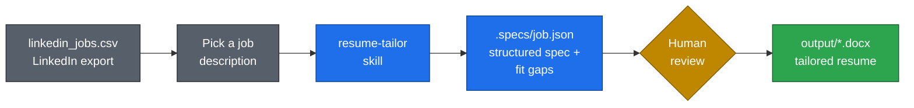
```mermaid
flowchart LR
    CSV["linkedin_jobs.csv<br/>LinkedIn export"] --> JD["Pick a job<br/>description"]
    JD --> SKILL["resume-tailor<br/>skill"]
    SKILL --> SPEC[".specs/job.json<br/>structured spec +<br/>fit gaps"]
    SPEC --> REVIEW{"Human<br/>review"}
    REVIEW --> DOCX["output/*.docx<br/>tailored resume"]

    classDef src fill:#57606a,stroke:#24292f,color:#fff
    classDef ai fill:#1f6feb,stroke:#0b3d91,color:#fff
    classDef gate fill:#bf8700,stroke:#7a5600,color:#fff
    classDef out fill:#2da44e,stroke:#0f5323,color:#fff
    class CSV,JD src
    class SKILL,SPEC ai
    class REVIEW gate
    class DOCX out
```

The repo ships two worked examples: specs and rendered docx files for an
Accenture Test Automation Lead and a Mouser Electronics Software QA Team Lead.

### Chapter 05: Job Tracker AI

A local-first kanban board for tracking job applications. Six columns from
Wishlist to Rejected, drag-and-drop between stages, all data stored in the
browser's IndexedDB so nothing leaves the machine.

#### Features

- Kanban board with six status columns: Wishlist, Applied, Follow-up, Interview, Offer, Rejected
- Drag-and-drop between columns via dnd-kit, with pointer and keyboard sensors
- Add/edit modal with company, role, LinkedIn URL, resume used, salary range, date applied, status, and notes
- Resume name autocomplete from previously used resumes
- Search by company or role, sort by newest or oldest applied date
- Header metrics: total jobs, interviews, offers
- JSON backup export and import (import replaces existing data after confirmation)
- Light/dark theme toggle persisted in localStorage
- Delete confirmation dialog, toast notifications, Escape-to-close modals

#### Tech stack

| Layer | Choice |
| --- | --- |
| UI | React 18 + Vite |
| Styling | Tailwind CSS 3 (`darkMode: 'class'`) |
| Drag and drop | @dnd-kit/core + @dnd-kit/sortable |
| Persistence | IndexedDB via `idb` |
| Icons | lucide-react |

#### Data model

Each job is one record in the `jobs` object store of the `job-tracker-ai`
IndexedDB database, keyed by `id`, indexed by `status` and `dateApplied`:

```js
{
  id: 'uuid',
  company: 'Accenture',
  role: 'Test Automation Lead',
  linkedInUrl: 'https://linkedin.com/jobs/...',
  resumeUsed: 'QA_Lead_Resume',
  dateApplied: '2026-08-23',
  salaryRange: '',
  notes: '',
  status: 'applied',   // wishlist | applied | follow-up | interview | offer | rejected
  createdAt: '...',
  updatedAt: '...',
}
```

#### Running the app

```bash
cd chapter_05_JobTrackerAI
npm install
npm run dev        # http://localhost:5173
```

#### State flow

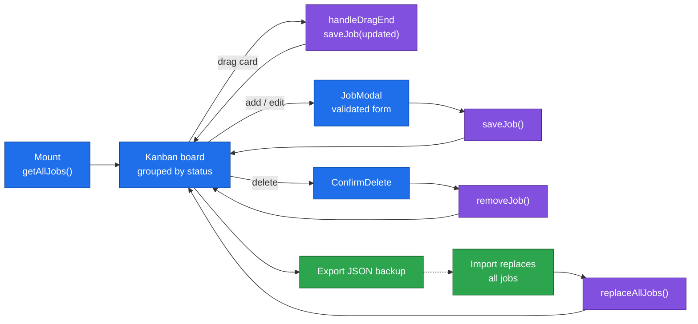
```mermaid
flowchart LR
    LOAD["Mount<br/>getAllJobs()"] --> BOARD["Kanban board<br/>grouped by status"]
    BOARD -->|"drag card"| DND["handleDragEnd<br/>saveJob(updated)"]
    BOARD -->|"add / edit"| MODAL["JobModal<br/>validated form"]
    MODAL --> SAVE["saveJob()"]
    BOARD -->|"delete"| CONFIRM["ConfirmDelete"] --> DEL["removeJob()"]
    BOARD --> EXPORT["Export JSON backup"]
    EXPORT -.-> IMPORT["Import replaces<br/>all jobs"] --> REPLACE["replaceAllJobs()"]
    DND --> BOARD
    SAVE --> BOARD
    DEL --> BOARD
    REPLACE --> BOARD

    classDef ui fill:#1f6feb,stroke:#0b3d91,color:#fff
    classDef store fill:#8250df,stroke:#4a1f8f,color:#fff
    classDef io fill:#2da44e,stroke:#0f5323,color:#fff
    class LOAD,BOARD,MODAL,CONFIRM ui
    class DND,SAVE,DEL,REPLACE store
    class EXPORT,IMPORT io
```

**Q&A - why use this?**
- **Q: When do I reach for it?** A: Any active job hunt where you are juggling more than a handful of applications across stages.
- **Q: What does it replace?** A: The spreadsheet. Status changes become a drag instead of a cell edit, and search plus metrics come free.
- **Q: What's the gotcha?** A: Data lives only in that browser's IndexedDB. Use Export before clearing site data or switching machines; import replaces everything.

### Chapter 06: Branding and LinkedIn Skills

A Claude/Codex skill that turns any content seed into a publish-ready pack in
The Testing Academy voice. Drop in a title, rough bullets, a screenshot, a URL,
a thread, or a spoken dump. The skill returns a Medium article, a LinkedIn post,
LinkedIn image prompts, and a Medium cover prompt.

The voice spec, deliverable formats, and a full worked example live in
[chapter_06_Branding_LinkedinSkills/README.md](chapter_06_Branding_LinkedinSkills/README.md).

#### What it produces

| File | Job |
| --- | --- |
| `pack-1-medium-article.md` | 2,500 to 3,200 word Medium draft |
| `pack-2-linkedin-post.md` | Hook ladder, 220 to 260 word post, first-comment blocks |
| `pack-3-linkedin-image-prompts.md` | Style C v2 tweet-screenshot cards |
| `pack-4-medium-image-prompt.md` | Style A 16:9 cyber infographic cover |

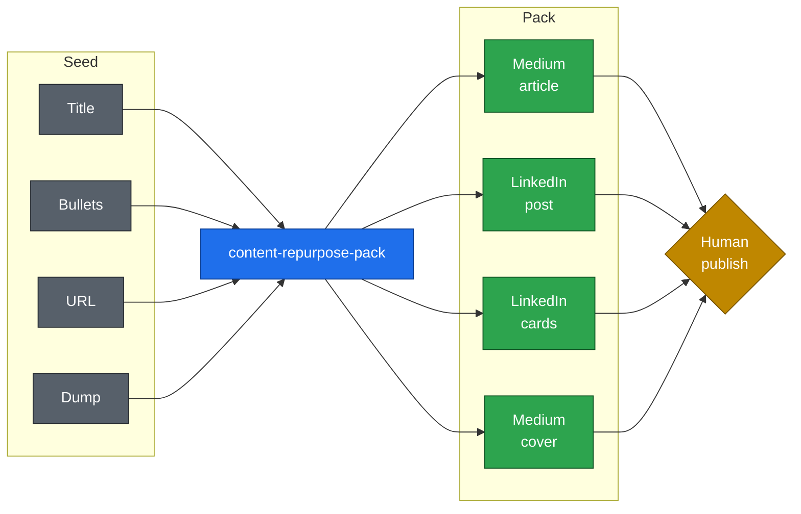
```mermaid
flowchart LR
    subgraph IN["Seed"]
        T["Title"]
        B["Bullets"]
        U["URL"]
        D["Dump"]
    end

    SKILL["content-repurpose-pack"]

    subgraph OUT["Pack"]
        P1["Medium<br/>article"]
        P2["LinkedIn<br/>post"]
        P3["LinkedIn<br/>cards"]
        P4["Medium<br/>cover"]
    end

    T --> SKILL
    B --> SKILL
    U --> SKILL
    D --> SKILL
    SKILL --> P1 --> PUB{"Human<br/>publish"}
    SKILL --> P2 --> PUB
    SKILL --> P3 --> PUB
    SKILL --> P4 --> PUB

    classDef src fill:#57606a,stroke:#24292f,color:#fff
    classDef ai fill:#1f6feb,stroke:#0b3d91,color:#fff
    classDef out fill:#2da44e,stroke:#0f5323,color:#fff
    classDef gate fill:#bf8700,stroke:#7a5600,color:#fff
    class T,B,U,D src
    class SKILL ai
    class P1,P2,P3,P4 out
    class PUB gate
```

#### File structure

```
chapter_06_Branding_LinkedinSkills/
├── files.zip                         # original archive
├── content-repurpose-pack.skill      # packaged bundle
└── content-repurpose-pack/
    ├── SKILL.md                      # pipeline and hook protocol
    └── references/
        ├── brand-voice.md            # Hook / Story / Offer, 13 threads
        ├── deliverable-specs.md      # exact formats for the four files
        └── worked-example.md         # one full input-to-output pass
```

#### Install the skill

```bash
skill_source=chapter_06_Branding_LinkedinSkills/content-repurpose-pack
skill_destination="$HOME/.claude/skills/content-repurpose-pack"

if [ -e "$skill_destination" ]; then
  echo "Skill already exists; compare and back it up before an explicitly approved update."
  exit 1
fi

mkdir -p "$(dirname "$skill_destination")"
cp -R "$skill_source" "$skill_destination"
```

For Codex, use `$HOME/.codex/skills/content-repurpose-pack`. Then invoke it by
name, such as `$content-repurpose-pack`.

#### Pack pipeline


```mermaid
flowchart LR
    SEED["Any seed<br/>title, bullets,<br/>URL, dump"] --> SHAPE["Identify shape<br/>reconcile the<br/>promised number"]
    SHAPE --> MINE["Mine five things<br/>thesis, framework,<br/>assets, numbers"]
    MINE --> VOICE["Map to voice<br/>Hook / Story / Offer"]
    VOICE --> PACK["Four pack files"]
    PACK --> SWEEP["Grep sweep<br/>chai, BFSI, sprint tests"]
    SWEEP --> PUBLISH{"Human<br/>publish"}

    classDef src fill:#57606a,stroke:#24292f,color:#fff
    classDef ai fill:#1f6feb,stroke:#0b3d91,color:#fff
    classDef gate fill:#bf8700,stroke:#7a5600,color:#fff
    classDef out fill:#2da44e,stroke:#0f5323,color:#fff
    class SEED src
    class SHAPE,MINE,VOICE,SWEEP ai
    class PACK out
    class PUBLISH gate
```

#### Voice spine

Same three beats on LinkedIn and Medium. Only the word budget changes. The usual
miss is a great Hook and Story with no Offer.


```mermaid
flowchart LR
    HOOK["HOOK<br/>earn the expand"] --> STORY["STORY<br/>one real receipt"]
    STORY --> OFFER["OFFER<br/>so what do I do"]

    classDef ai fill:#1f6feb,stroke:#0b3d91,color:#fff
    classDef pack fill:#8250df,stroke:#4a1f8f,color:#fff
    classDef out fill:#2da44e,stroke:#0f5323,color:#fff
    class HOOK ai
    class STORY pack
    class OFFER out
```

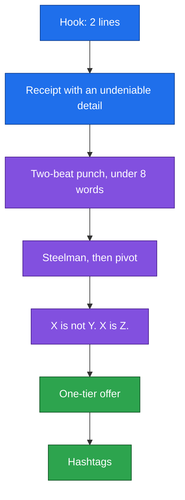
```mermaid
flowchart TB
    L1["Hook: 2 lines"] --> L2["Receipt with an undeniable detail"]
    L2 --> L3["Two-beat punch, under 8 words"]
    L3 --> L4["Steelman, then pivot"]
    L4 --> L5["X is not Y. X is Z."]
    L5 --> L6["One-tier offer"]
    L6 --> L7["Hashtags"]

    classDef ai fill:#1f6feb,stroke:#0b3d91,color:#fff
    classDef pack fill:#8250df,stroke:#4a1f8f,color:#fff
    classDef out fill:#2da44e,stroke:#0f5323,color:#fff
    class L1,L2 ai
    class L3,L4,L5 pack
    class L6,L7 out
```

Offer rotation: four posts on a belief or a question, then one free asset, and a
product link only for real launches.

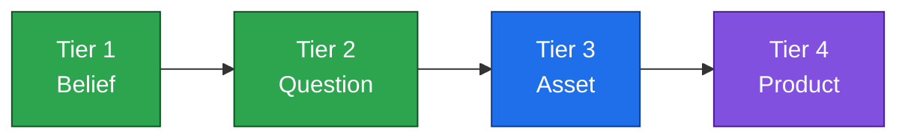
```mermaid
flowchart LR
    T1["Tier 1<br/>Belief"] --> T2["Tier 2<br/>Question"]
    T2 --> T3["Tier 3<br/>Asset"]
    T3 --> T4["Tier 4<br/>Product"]

    classDef out fill:#2da44e,stroke:#0f5323,color:#fff
    classDef ai fill:#1f6feb,stroke:#0b3d91,color:#fff
    classDef pack fill:#8250df,stroke:#4a1f8f,color:#fff
    class T1,T2 out
    class T3 ai
    class T4 pack
```

#### Hook ladder

When the ask is controversial, the skill returns three labelled variants instead
of sanitizing or refusing.

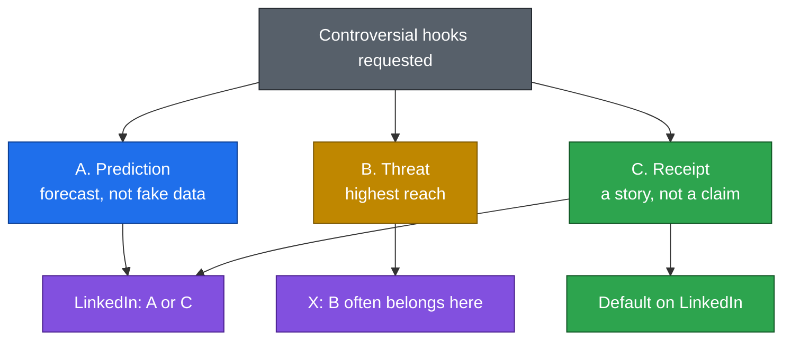
```mermaid
flowchart TB
    ASK["Controversial hooks requested"] --> A["A. Prediction<br/>forecast, not fake data"]
    ASK --> B["B. Threat<br/>highest reach"]
    ASK --> C["C. Receipt<br/>a story, not a claim"]

    A --> LI["LinkedIn: A or C"]
    C --> LI
    B --> X["X: B often belongs here"]
    C --> REC["Default on LinkedIn"]

    classDef src fill:#57606a,stroke:#24292f,color:#fff
    classDef ai fill:#1f6feb,stroke:#0b3d91,color:#fff
    classDef gate fill:#bf8700,stroke:#7a5600,color:#fff
    classDef out fill:#2da44e,stroke:#0f5323,color:#fff
    classDef pack fill:#8250df,stroke:#4a1f8f,color:#fff
    class ASK src
    class A ai
    class B gate
    class C,REC out
    class LI,X pack
```

**Q&A - why use this?**
- **Q: When do I reach for it?** A: When a seed needs to become a Medium + LinkedIn + image pack in this voice, not a generic rewrite.
- **Q: What does it replace?** A: Re-prompting from scratch for length, banned phrases, first-comment splits, and image specs.
- **Q: What's the gotcha?** A: A pack with no receipt is the biggest quality drop. Supply a real story, or accept a composite flagged for anonymization. No em dashes, anywhere.

### Chapter 07: AI Agents

A **Test Plan Agent**: give it a Jira ID, get back a formal 14-section test plan
where every claim traces to a real field on the ticket. Built with the
**B.L.A.S.T.** protocol on the **A.N.T.** 3-layer architecture.

**Why:** the naive version (paste a ticket into a chat window, ask for a test plan)
hallucinates acceptance criteria, produces a different shape every run, and gives you
no way to tell which step went wrong when the output is bad.

**Q&A - why use this?**
- **Q: When do I reach for it?** A: When a story needs a review-ready test plan and you need every scope decision defensible to a reviewer.
- **Q: What does it replace?** A: Hand-writing the same 14 sections per ticket, and the re-prompting loop when a chat model drifts from your template.
- **Q: What's the gotcha?** A: It will refuse a thin ticket rather than invent one, returning a gap report instead. That is the design, not a bug: 2 of 4 real tickets were refused in testing.

#### The B.L.A.S.T. protocol

Five phases with hard gates. Nothing enters `tools/` until Discovery Questions are
answered, the data schema is frozen, and the blueprint is approved.

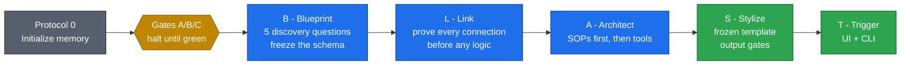
```mermaid
flowchart LR
    P0["Protocol 0<br/>Initialize memory"] --> GATE{{"Gates A/B/C<br/>halt until green"}}
    GATE --> B["B - Blueprint<br/>5 discovery questions<br/>freeze the schema"]
    B --> L["L - Link<br/>prove every connection<br/>before any logic"]
    L --> A["A - Architect<br/>SOPs first, then tools"]
    A --> S["S - Stylize<br/>frozen template<br/>output gates"]
    S --> T["T - Trigger<br/>UI + CLI"]

    classDef src fill:#57606a,stroke:#24292f,color:#fff
    classDef gate fill:#bf8700,stroke:#7a5600,color:#fff
    classDef ai fill:#1f6feb,stroke:#0b3d91,color:#fff
    classDef out fill:#2da44e,stroke:#0f5323,color:#fff
    class P0 src
    class GATE gate
    class B,L,A ai
    class S,T out
```

Four memory files carry the project state: `task_plan.md` (phases and checklists),
`findings.md` (research and constraints), `progress.md` (a timestamped log of what was
done, what errored, what the result was), and `LLM.md` (the constitution: schemas,
18 behavioural rules, 10 architectural invariants).

#### A.N.T. 3-layer architecture

The premise: **LLMs are probabilistic, business logic must be deterministic.** So the
pipeline is seven steps and exactly one of them calls a model.

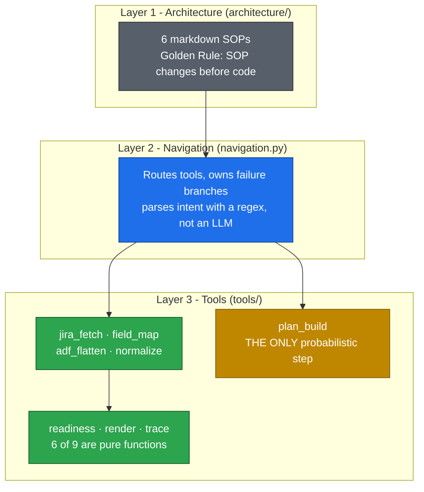
```mermaid
flowchart TB
    subgraph L1["Layer 1 - Architecture (architecture/)"]
        SOP["6 markdown SOPs<br/>Golden Rule: SOP changes before code"]
    end
    subgraph L2["Layer 2 - Navigation (navigation.py)"]
        NAV["Routes tools, owns failure branches<br/>parses intent with a regex, not an LLM"]
    end
    subgraph L3["Layer 3 - Tools (tools/)"]
        T1["jira_fetch · field_map<br/>adf_flatten · normalize"]
        T2["readiness · render · trace<br/>6 of 9 are pure functions"]
        T3["plan_build<br/>THE ONLY probabilistic step"]
    end

    SOP --> NAV --> T1 --> T2
    NAV --> T3

    classDef src fill:#57606a,stroke:#24292f,color:#fff
    classDef ai fill:#1f6feb,stroke:#0b3d91,color:#fff
    classDef gate fill:#bf8700,stroke:#7a5600,color:#fff
    classDef out fill:#2da44e,stroke:#0f5323,color:#fff
    class SOP src
    class NAV ai
    class T1,T2 out
    class T3 gate
```

The pipeline, end to end:

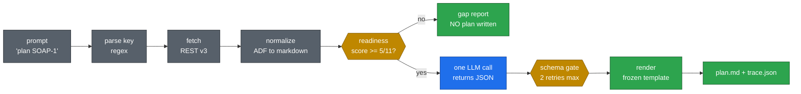
```mermaid
flowchart LR
    P["prompt<br/>'plan SOAP-1'"] --> K["parse key<br/>regex"]
    K --> F["fetch<br/>REST v3"]
    F --> N["normalize<br/>ADF to markdown"]
    N --> R{{"readiness<br/>score >= 5/11?"}}
    R -->|no| GAP["gap report<br/>NO plan written"]
    R -->|yes| LLM["one LLM call<br/>returns JSON"]
    LLM --> V{{"schema gate<br/>2 retries max"}}
    V --> RND["render<br/>frozen template"]
    RND --> MD["plan.md + trace.json"]

    classDef src fill:#57606a,stroke:#24292f,color:#fff
    classDef ai fill:#1f6feb,stroke:#0b3d91,color:#fff
    classDef gate fill:#bf8700,stroke:#7a5600,color:#fff
    classDef out fill:#2da44e,stroke:#0f5323,color:#fff
    class P,K,F,N src
    class LLM ai
    class R,V gate
    class RND,MD,GAP out
```

#### Running the agent

```bash
cd chapter_07_AI_Agents/Test-Plan-Agent-Blast
pip install -r requirements.txt
cp .env.example .env          # or use the Settings page
streamlit run app.py          # UI on :8501
```

Open **Settings** first: add the Jira URL, email and API token plus an LLM key
(DeepSeek or Groq, both OpenAI-compatible), then press both **Test connection**
buttons. The CLI mirrors the UI:

```bash
python run.py SOAP-1                    # generate a plan
python run.py "make a plan for VWO-49"  # natural language, same result
python run.py --health                  # prove both connections
python run.py --dry-run SOAP-1          # fetch + normalize, no LLM call
```

Exit codes: `0` ok, `2` bad input, `3` auth, `4` not found, `5` rate limited,
`6` schema violation, `7` LLM failure.

#### Anti-hallucination design

The model returns **JSON, not markdown**. `render.py` owns the format, so the model
never sees the template and cannot drift from it. Two schema fields do the real work:

```json
{
  "scope": [{
    "type": "Error Handling",
    "rationale": "Assert the 400 response names the offending field.",
    "justified_by": "FR-03: the system must reject requests missing sISBN."
  }],
  "assumptions": [{
    "field": "environment.url",
    "assumed_value": "QA environment (URL not specified in ticket)",
    "why": "Ticket does not provide a concrete environment URL"
  }]
}
```

`justified_by` is required on every scope entry and must name the ticket fact that put
it there. A model that cannot fill it has just admitted the entry is padding, and the
schema rejects the response. That turns "please do not hallucinate" from a hopeful
instruction into a structural constraint. Anything filled without ticket evidence lands
in `assumptions[]` and renders into the deliverable, not into a debug log.

#### Field notes from the build

Three findings that only surfaced by running it against a live Jira and a live model:

| Finding | Why it matters |
|---|---|
| **Jira answers 404, not 401**, on `/issue/{key}` when auth is bad | It hides issue existence from unauthenticated callers, so an expired token presents as a *missing ticket*. The fix is to call `/myself` on a 404 to disambiguate. |
| **Groq counts `max_tokens` against the TPM limit** | The reservation is billed, not the completion. A 2,669-token prompt with `max_tokens: 8000` reads as 10,669 against an 8,000 cap. Check the reservation before slimming the payload. |
| **`config.json` silently shadowed `.env`** | Saving credentials in the UI wrote them to `config.json`, which outranks `.env`, so later edits to `.env` were ignored with no indication. Settings now shows the source of every value. |

### Chapter 08: n8n Agents

Nine n8n workflows plus the prompt files that drive them. The chapter walks the same
Jira-agent idea from chapter 07 across a visual low-code canvas, then pushes past it
into multi-tool agents (Jira + Google Sheets), local models, a deterministic RCA
pipeline, a LinkedIn content chain, a scheduled poster that stops for human approval
before it publishes, a screenshot-to-bug-report intake, and a custom React UI
(`ui_screenshotbugAIAgent/`) deployed on Vercel that wraps workflow 09 behind a
branded, paste-friendly front end.

**Why:** an agent loop drawn on a canvas is legible to people who will not read a call
stack. It also makes the failure modes visible: you can see exactly where the LLM is
allowed to decide, and where a plain node does the work.

```
chapter_08_n8n/
├── 01_Raw_BugTriage.prompt.md        # the persona-only triage prompt (v1)
├── 02_ModifiedBugTriagePrompt.prompt.md  # v2: same persona + tool-calling contract
├── 03_RCA_AI_Agent.prompt.md         # the meta-prompt that generated workflow 05
├── Agents/
│   ├── 01_FetchJIRATicket_AIAgent.json   # 9 nodes: chat/schedule -> agent -> Jira get
│   ├── 02_CreateJIRATicket_AIAgent.json  # 9 nodes: same shape, Jira create
│   ├── 03_FetchJIRACreateTCAIAgent_Local_LLM_ollama.json  # 6 nodes: local Ollama / Groq brain
│   ├── 04_BugTriageAIAgent.json          # 12 nodes: Jira + Google Sheets, two tools
│   ├── 05_RCA_Chatgpt_Jira_Production_Bug_RCA_Automation.json  # 35 nodes: full RCA pipeline
│   ├── 06_Social_Media_AIAgent.json      # 15 nodes: topic -> post -> image -> review -> LinkedIn
│   ├── 07_Social_Post_Generator (Gemini+ Upload Post).json  # 14 nodes: scheduled post + Telegram approval
│   ├── 08_Screenshot_To_Bug_Reporter_AIAgent.json  # 11 nodes: screenshot -> vision -> Jira bug
│   ├── 09_Screenshot_To_Bug_Reporter_AIAgent_UI.json  # webhook variant for the custom UI
│   ├── Plan.md                       # model research + design notes for 08
│   ├── Prompt.md                     # the build prompt that produced 08 and 09
│   └── screenshot-bug-reporter-live-run.png  # a real run: VWO-125 filed from a login error
└── resources/
    ├── Jira_Bug_Triage_Sample.xlsx   # the triage sheet the agent writes into
    └── VWO-49_RCA.doc                # a sample RCA output
```

Import any file through **n8n > Workflows > Import from File**, then attach your own
credentials. n8n stores credentials by reference, so the exported JSON carries no secrets.
Workflow 07 is the one exception worth knowing about: it calls the Gemini image endpoint
through a raw HTTP Request node, so the key travels in a plain header parameter rather
than a credential. That value ships as the placeholder `YOUR_GEMINI_API_KEY`. Replace it
on import, or better, move it into a Header Auth credential (see the Q&A under 07).

#### The Jira agent pair (01, 02)

The starting shape: a trigger, a brain, a memory, and exactly one Jira tool. A chat
message like "fetch PROJ-12" or "raise a bug for the login page" becomes a real Jira
API call.

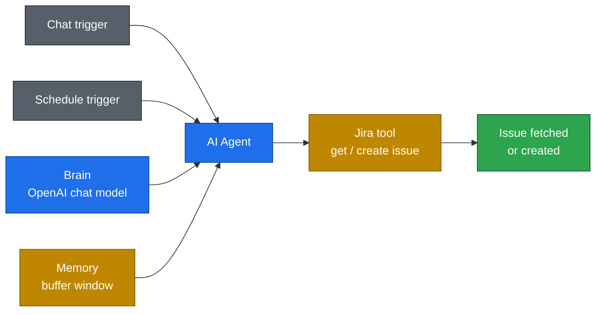
```mermaid
flowchart LR
    CT["Chat trigger"] --> AG["AI Agent"]
    ST["Schedule trigger"] --> AG
    BR["Brain<br/>OpenAI chat model"] --> AG
    ME["Memory<br/>buffer window"] --> AG
    AG --> JT["Jira tool<br/>get / create issue"]
    JT --> OUT["Issue fetched<br/>or created"]

    classDef src fill:#57606a,stroke:#24292f,color:#fff
    classDef ai fill:#1f6feb,stroke:#0b3d91,color:#fff
    classDef gate fill:#bf8700,stroke:#7a5600,color:#fff
    classDef out fill:#2da44e,stroke:#0f5323,color:#fff
    class CT,ST src
    class AG,BR ai
    class ME,JT gate
    class OUT out
```

**Q&A - why use this?**
- **Q: When do I reach for it?** A: When the workflow should be editable by someone who does not write Python, or when it needs to run on a schedule without hosting your own app.
- **Q: What does it replace?** A: The glue code around auth, retries and scheduling.
- **Q: What's the gotcha?** A: The agent decides *when* to call the Jira tool, so a vague prompt can create the wrong ticket. Chapter 07's approach (deterministic fetch, one bounded LLM step) trades that flexibility for repeatability.

#### Swapping the brain: local Ollama and Groq (03)

The same fetch agent with the OpenAI node replaced. Two model nodes sit in the file:
an **Ollama Chat Model** (wired in, runs on your own machine) and a **Groq Chat Model**
(parked, swap the connection to use it). Memory is dropped, so the run is stateless.

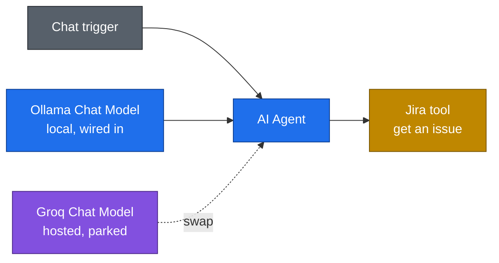
```mermaid
flowchart LR
    CT["Chat trigger"] --> AG["AI Agent"]
    OL["Ollama Chat Model<br/>local, wired in"] --> AG
    GQ["Groq Chat Model<br/>hosted, parked"] -.swap.-> AG
    AG --> JT["Jira tool<br/>get an issue"]

    classDef src fill:#57606a,stroke:#24292f,color:#fff
    classDef ai fill:#1f6feb,stroke:#0b3d91,color:#fff
    classDef alt fill:#8250df,stroke:#4c2889,color:#fff
    classDef gate fill:#bf8700,stroke:#7a5600,color:#fff
    class CT src
    class AG,OL ai
    class GQ alt
    class JT gate
```

**Q&A - why use this?**
- **Q: Why bother running locally?** A: Ticket text is company data. A local model keeps it on your machine, and the token bill goes to zero.
- **Q: What breaks?** A: Small local models are weaker at tool calling. They will describe the Jira call instead of making it. Groq is the middle ground: hosted and fast, but still not OpenAI-grade at multi-step tool use.
- **Q: How do I decide?** A: Start on a hosted model to prove the workflow, then downgrade the brain and see if the tool calls survive.

#### Bug triage into Google Sheets (04)

The first genuinely multi-tool agent: it reads **many** Jira issues, triages each one,
and writes a row per issue into a Google Sheet keyed on `jira_key`. Four brains are
present in the file (OpenAI wired in, Groq and DeepSeek parked) so you can A/B the
triage quality on the same prompt.

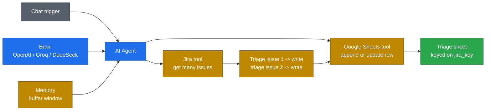
```mermaid
flowchart LR
    CT["Chat trigger"] --> AG["AI Agent"]
    BR["Brain<br/>OpenAI / Groq / DeepSeek"] --> AG
    ME["Memory<br/>buffer window"] --> AG
    AG --> JT["Jira tool<br/>get many issues"]
    AG --> GS["Google Sheets tool<br/>append or update row"]
    JT --> LOOP["Triage issue 1 -> write<br/>triage issue 2 -> write"]
    LOOP --> GS
    GS --> OUT["Triage sheet<br/>keyed on jira_key"]

    classDef src fill:#57606a,stroke:#24292f,color:#fff
    classDef ai fill:#1f6feb,stroke:#0b3d91,color:#fff
    classDef gate fill:#bf8700,stroke:#7a5600,color:#fff
    classDef out fill:#2da44e,stroke:#0f5323,color:#fff
    class CT src
    class AG,BR ai
    class ME,JT,GS,LOOP gate
    class OUT out
```

The two prompt files next to it are the interesting part, because they are the same
prompt one revision apart:

| | `01_Raw_BugTriage.prompt.md` | `02_ModifiedBugTriagePrompt.prompt.md` |
|---|---|---|
| Length | 72 lines | 370 lines |
| Covers | Persona, severity vs priority, S0-S4 and P0-P4 scales, category taxonomy, triage checklist, rules of the desk | All of that, **plus** the tool contract |
| Missing | Any mention of the tools | - |
| Adds | - | Mandatory execution order, pagination and dedup rules, per-issue write loop, column-by-column sheet mapping, sheet-tool error handling, final summary format |

Version 1 produces excellent triage *as text*. It does not reliably call Google Sheets,
because nothing in it says the agent must. Version 2 keeps the judgment intact and bolts
on the execution contract: retrieve, triage one, **write one**, repeat, and never invent
a Jira issue.

**Q&A - why use this?**
- **Q: What is the actual lesson?** A: A great persona prompt is not an agent prompt. The moment tools enter, you have to spell out the call order, the loop granularity, and what counts as success.
- **Q: Why write one row at a time?** A: Batching at the end means one failure loses the whole run. Per-issue writes make a partial run still useful.
- **Q: Why is `jira_key` the match column?** A: It makes the write idempotent. Re-running updates rows instead of duplicating them.

#### Production bug RCA pipeline (05)

The largest workflow in the repo: 35 nodes that turn a Jira production-bug event into a
formatted RCA workbook in Google Drive, as both a Google Sheet and an `.xlsx` export.

The architectural rule is the opposite of workflow 04. Jira, Drive and Sheets are **not**
agent tools here. They are plain deterministic nodes. The AI Agent does exactly one job:
turn the evidence package into structured RCA JSON, validated by an output parser.

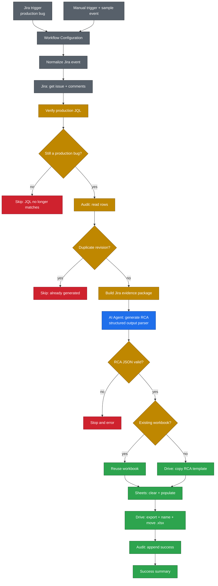
```mermaid
flowchart TD
    JT["Jira trigger<br/>production bug"] --> CFG["Workflow Configuration"]
    MT["Manual trigger + sample event"] --> CFG
    CFG --> NRM["Normalize Jira event"]
    NRM --> GET["Jira: get issue + comments"]
    GET --> JQL["Verify production JQL"]
    JQL --> ISP{"Still a production bug?"}
    ISP -->|no| SK1["Skip: JQL no longer matches"]
    ISP -->|yes| AUD["Audit: read rows"]
    AUD --> DUP{"Duplicate revision?"}
    DUP -->|yes| SK2["Skip: already generated"]
    DUP -->|no| EV["Build Jira evidence package"]
    EV --> AI["AI Agent: generate RCA<br/>structured output parser"]
    AI --> VAL{"RCA JSON valid?"}
    VAL -->|no| ERR["Stop and error"]
    VAL -->|yes| WB{"Existing workbook?"}
    WB -->|yes| REUSE["Reuse workbook"]
    WB -->|no| COPY["Drive: copy RCA template"]
    REUSE --> POP["Sheets: clear + populate"]
    COPY --> POP
    POP --> XLSX["Drive: export + name + move .xlsx"]
    XLSX --> LOG["Audit: append success"]
    LOG --> SUM["Success summary"]

    classDef src fill:#57606a,stroke:#24292f,color:#fff
    classDef ai fill:#1f6feb,stroke:#0b3d91,color:#fff
    classDef gate fill:#bf8700,stroke:#7a5600,color:#fff
    classDef out fill:#2da44e,stroke:#0f5323,color:#fff
    classDef bad fill:#cf222e,stroke:#82071e,color:#fff
    class JT,MT,CFG,NRM,GET src
    class AI ai
    class JQL,ISP,DUP,VAL,WB,EV,AUD gate
    class COPY,REUSE,POP,XLSX,LOG,SUM out
    class SK1,SK2,ERR bad
```

Three guards run before a single token is spent: the JQL re-check (the label may have
been removed since the trigger fired), the audit-table dedup (same issue, same revision,
already done), and the structured-output validation (a malformed RCA stops the run
instead of writing garbage into the template).

`03_RCA_AI_Agent.prompt.md` is the 1019-line meta-prompt that produced this workflow. It
specifies the config Set node, the template requirement, every node in the required
workflow, the RCA agent system prompt, the structured output schema, the human review
rule, and the acceptance tests. The workflow JSON is the output; the prompt is the spec.

**Q&A - why use this?**
- **Q: Why not let the agent call Jira and Sheets itself, like workflow 04?** A: Because an RCA writes into a shared template that people sign off on. You do not want the model deciding whether to copy a file. Agentic where judgment is needed, deterministic everywhere else.
- **Q: What does the audit table buy me?** A: Idempotency. Jira fires on every update; without the audit row you would generate a fresh RCA workbook on every comment.
- **Q: Why copy a template instead of building the sheet?** A: The template carries formatting, formulas, dropdowns and named worksheets. Copying preserves all of it; generating from scratch loses it.

#### Social media content chain (06)

Two independent pipelines in one file, both on schedule triggers. The main chain is a
sequence of specialised agents rather than one agent with many tools:

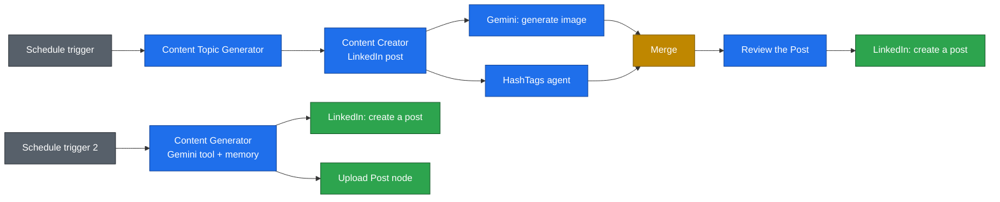
```mermaid
flowchart LR
    ST["Schedule trigger"] --> TG["Content Topic Generator"]
    TG --> CC["Content Creator<br/>LinkedIn post"]
    CC --> IMG["Gemini: generate image"]
    CC --> HT["HashTags agent"]
    IMG --> MG["Merge"]
    HT --> MG
    MG --> RV["Review the Post"]
    RV --> LI["LinkedIn: create a post"]

    ST2["Schedule trigger 2"] --> CG["Content Generator<br/>Gemini tool + memory"]
    CG --> LI2["LinkedIn: create a post"]
    CG --> UP["Upload Post node"]

    classDef src fill:#57606a,stroke:#24292f,color:#fff
    classDef ai fill:#1f6feb,stroke:#0b3d91,color:#fff
    classDef gate fill:#bf8700,stroke:#7a5600,color:#fff
    classDef out fill:#2da44e,stroke:#0f5323,color:#fff
    class ST,ST2 src
    class TG,CC,HT,RV,CG,IMG ai
    class MG gate
    class LI,LI2,UP out
```

**Q&A - why use this?**
- **Q: Why five agents instead of one?** A: Each one has a single job and a short prompt, so you can read its output and fix the one that is wrong. A single mega-agent asked to pick a topic, write, illustrate, tag and review will quietly do the last step badly.
- **Q: What is the Review node for?** A: It is the quality gate before anything reaches a real audience. Swap it for a manual approval node if you are not ready to auto-post.
- **Q: How does this relate to chapter 06?** A: Chapter 06 is the voice and hook system as a Claude skill. This is the same idea running unattended on a schedule.

#### Scheduled post generator with human approval (07)

**Concept:** a fully unattended LinkedIn poster that runs every morning at 10:00, writes
the post, generates its own illustration, and then **stops** and asks a human on Telegram
to approve before anything is published.

**Why:** workflow 06 gates its output with another agent. An LLM reviewing an LLM catches
tone problems but will never catch the one that matters, which is a post you simply did
not want to go out under your name. This chain puts a person in that seat without
re-introducing the manual work of writing.

Two vendors sit in one chain on purpose. Gemini Flash picks the topic (cheap, high volume,
low stakes) and GPT writes the post (the step whose quality you actually feel). The image
comes from the Gemini image endpoint via a raw HTTP Request node, is converted to a binary
PNG, and rides along as the LinkedIn share media.

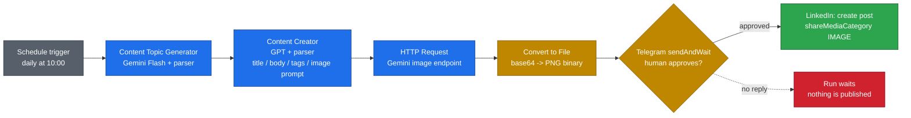
```mermaid
flowchart LR
    ST["Schedule trigger<br/>daily at 10:00"] --> TG["Content Topic Generator<br/>Gemini Flash + parser"]
    TG --> CC["Content Creator<br/>GPT + parser<br/>title / body / tags / image prompt"]
    CC --> IMG["HTTP Request<br/>Gemini image endpoint"]
    IMG --> CF["Convert to File<br/>base64 -> PNG binary"]
    CF --> TA{"Telegram sendAndWait<br/>human approves?"}
    TA -->|approved| LI["LinkedIn: create post<br/>shareMediaCategory IMAGE"]
    TA -.no reply.-> HOLD["Run waits<br/>nothing is published"]

    classDef src fill:#57606a,stroke:#24292f,color:#fff
    classDef ai fill:#1f6feb,stroke:#0b3d91,color:#fff
    classDef gate fill:#bf8700,stroke:#7a5600,color:#fff
    classDef out fill:#2da44e,stroke:#0f5323,color:#fff
    classDef bad fill:#cf222e,stroke:#82071e,color:#fff
    class ST src
    class TG,CC,IMG ai
    class CF,TA gate
    class LI out
    class HOLD bad
```

The whole gate is one node. `sendAndWait` suspends the execution and resumes it only when
the reply arrives, so no approval means no post rather than a default-yes:

```json
{
  "name": "Send a text message",
  "type": "n8n-nodes-base.telegram",
  "parameters": {
    "operation": "sendAndWait",
    "chatId": "859100842",
    "message": "={{ $('Content Creator (Linkedin Post)').item.json.output.post_body }}"
  }
}
```

```json
{
  "name": "Create a post",
  "type": "n8n-nodes-base.linkedIn",
  "parameters": {
    "text": "={{ $('Content Creator (Linkedin Post)').item.json.output.post_body }}",
    "shareMediaCategory": "IMAGE",
    "additionalFields": {
      "title": "={{ $('Content Creator (Linkedin Post)').item.json.output.post_title }}",
      "visibility": "PUBLIC"
    }
  }
}
```

| | 06: agent review | 07: human approval |
|---|---|---|
| Gate | `Review the Post` agent | Telegram `sendAndWait` |
| Blocks on | Model judgment | A real reply |
| Failure mode | Approves a bad post confidently | Nothing posts until you answer |
| Use when | Volume matters more than any single post | Your name is on it |

**Q&A - why use this?**
- **Q: Why `sendAndWait` instead of a Telegram send plus an IF node?** A: `sendAndWait` parks the execution and resumes on reply. A plain send would fire the message and continue straight into the LinkedIn node, which is exactly the thing the gate exists to prevent.
- **Q: Why does the image go through an HTTP Request node instead of the Gemini node?** A: The image endpoint returns base64 inside a nested `steps[1].content[0].data` path, so the response needs a `Convert to File` step to become the PNG binary LinkedIn wants. That also means the key lives in a header parameter, not a credential. Swap `YOUR_GEMINI_API_KEY` for a **Header Auth** credential (`authentication: genericCredentialType`) if you would rather it never touched the JSON.
- **Q: What's the gotcha?** A: The topic-generator's output parser is set to `manual` with no schema, so the second agent's prompt reads `$json.output.properties.topic.type` and picks up the literal string `"string"` out of the JSON Schema envelope instead of the topic. Fill in the first parser's `inputSchema` (as the second one does) and the expression shortens to `$json.output.topic`. It is a good illustration of the real hazard in visual pipelines: a wrong expression does not crash, it quietly feeds plausible garbage forward.

#### Screenshot to bug reporter (08)

**Concept:** a hosted upload form takes a screenshot plus optional error logs, a vision
model drafts a complete structured bug report from what it can actually see, and the
workflow files it into Jira with the original PNG attached to the ticket.

**Why:** the visual detail is the part testers summarise away. The red banner, the
overlapping div, the truncated error string: all of it is in the screenshot and almost
none of it survives being retyped into a ticket by hand.

This is the first workflow in the chapter with a **human file-upload intake**. Nothing in
01-07 ingests a user-supplied file, and the string `base64` appears nowhere else in the
chapter.


```mermaid
flowchart LR
    FT["Form trigger<br/>screenshot + logs"] --> NI["Normalize intake<br/>resolve binary, build prompts"]
    NI --> B64["Extract from file<br/>binary to base64"]
    B64 --> GV["Groq vision<br/>qwen3.6-27b, JSON mode"]
    GV --> PB["Parse bug report<br/>validate + render description"]
    PB --> JC["Jira: create bug<br/>VWO / Bug"]
    JC --> PA["Prepare attachment<br/>re-attach binary"]
    PA --> JA["Jira: add attachment<br/>screenshot on the ticket"]

    classDef src fill:#57606a,stroke:#24292f,color:#fff
    classDef ai fill:#1f6feb,stroke:#0b3d91,color:#fff
    classDef gate fill:#bf8700,stroke:#7a5600,color:#fff
    classDef out fill:#2da44e,stroke:#0f5323,color:#fff
    class FT src
    class GV ai
    class NI,B64,PB,PA gate
    class JC,JA out
```

Note what is **not** here: no AI Agent node. The model gets exactly one bounded job, and
every other step is a plain deterministic node. This is workflow 05's shape, not workflow
01's. An agent node would also hand the tool-calling loop the decision of whether to look
at the image at all.

The whole model call is one HTTP node, and the key never enters the file:

```json
{
  "method": "POST",
  "url": "https://api.groq.com/openai/v1/chat/completions",
  "authentication": "predefinedCredentialType",
  "nodeCredentialType": "groqApi",
  "jsonBody": "={{ JSON.stringify({ model: 'qwen/qwen3.6-27b', response_format: { type: 'json_object' }, messages: [ { role: 'system', content: $('Normalize Intake').first().json.system_prompt }, { role: 'user', content: [ { type: 'text', text: $('Normalize Intake').first().json.user_prompt }, { type: 'image_url', image_url: { url: 'data:' + $('Normalize Intake').first().json.mime_type + ';base64,' + $json.screenshot_b64 } } ] } ] }) }}"
}
```

`Agents/Plan.md` carries the full model research. The short version is that Groq's vision
lineup contracted through 2026: `llama-3.2-11b-vision` was decommissioned and Llama 4
Scout and Maverick left the supported list, so the only image-capable models left are
`qwen/qwen3.6-27b` and `qwen/qwen3.8-27b`, both Preview.

| | Groq `qwen3.6-27b` | OpenRouter `glm-5.3-flash` |
|---|---|---|
| Input / output per M | $0.60 / $3.00 | $0.075 / $0.25 |
| Per bug report | ~$0.0036 | ~$0.0004 |
| Status | Preview | Production |
| JSON | `response_format` honoured | No server-side schema enforcement |
| Pick it for | Speed | Cost, and stability |

**Q&A - why use this?**
- **Q: Why is the binary re-attached twice?** A: Because it does not survive the HTTP hop, and Jira's create response carries none either. Nodes 5 and 7 both pull it back from `$('Normalize Intake').first().binary`. Forgetting this is the single most common way a file-handling n8n workflow silently posts a ticket with no attachment.
- **Q: Why resolve the uploaded file by `Object.keys(item.binary)[0]` instead of by name?** A: The Form Trigger derives the binary property name from the field label, and the exact form has changed between n8n versions. Taking the first key and re-keying it to a stable `screenshot` property means the rest of the workflow depends on our name, not n8n's.
- **Q: What's the gotcha?** A: A vision model asked for a bug report will always produce one. Upload a screenshot of a perfectly healthy page and a careless prompt invents a defect to fill the schema. The system prompt therefore forbids inventing anything not visible and requires a `confidence` field, and that unbroken-page run is the test worth doing first.

#### Screenshot to bug reporter UI (09)

**Concept:** workflow 08 with its Form Trigger swapped for a **Webhook** and a **Respond to
Webhook** node bolted on the end, so a custom front end can call it as a JSON API and get
the filed ticket back instead of an n8n-hosted HTML page.

**Why:** an n8n form is fine for a demo, but the moment you want your own branding, a paste
-from-clipboard upload, or the Jira key rendered back to the reporter, you need a real API
and a real UI in front of it.

The front end lives in [`ui_screenshotbugAIAgent/`](ui_screenshotbugAIAgent/) (Vite + React
+ Tailwind) and is deployed on Vercel. A real run, end to end:

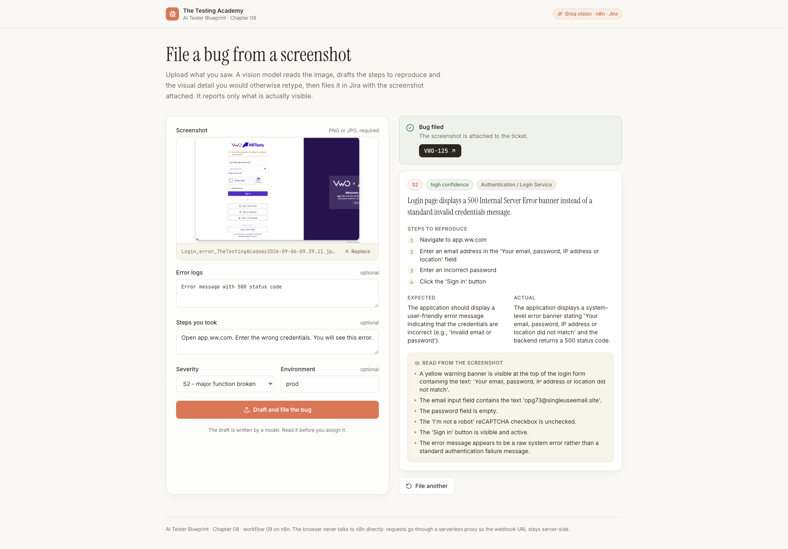

Note what the model read off that screenshot: the exact banner text, the email in the input
(`opg73@singleuseemail.site`), the empty password field, the unchecked reCAPTCHA. That is
the detail a tester would never retype by hand.

```mermaid
flowchart LR
    UI["Vercel UI<br/>paste or drop a screenshot"] --> PX["/api/report<br/>serverless proxy"]
    PX --> WH["n8n Webhook<br/>POST screenshot-bug-report"]
    WH --> NI["Normalize intake"]
    NI --> GV["Groq vision<br/>qwen3.8-27b, JSON mode"]
    GV --> JC["Jira: create + attach"]
    JC --> RW["Respond to Webhook<br/>jira_key, summary, confidence"]
    RW --> UI

    classDef src fill:#57606a,stroke:#24292f,color:#fff
    classDef ai fill:#1f6feb,stroke:#0b3d91,color:#fff
    classDef gate fill:#bf8700,stroke:#7a5600,color:#fff
    classDef out fill:#2da44e,stroke:#0f5323,color:#fff
    class UI src
    class GV ai
    class PX,WH,NI gate
    class JC,RW out
```

The browser never calls n8n. It posts to a same-origin serverless function, which forwards
the raw multipart body server-side:

```js
// ui_screenshotbugAIAgent/api/report.js
export const config = { api: { bodyParser: false } };  // keep the multipart boundary intact

export default async function handler(req, res) {
  const target = process.env.N8N_WEBHOOK_URL;          // never reaches the browser
  const chunks = [];
  for await (const chunk of req) chunks.push(chunk);

  const upstream = await fetch(target, {
    method: 'POST',
    headers: { 'content-type': req.headers['content-type'] },
    body: Buffer.concat(chunks),
  });
  return res.status(200).json(JSON.parse(await upstream.text()));
}
```

**Q&A - why use this?**
- **Q: Why a proxy instead of calling n8n from the browser?** A: Two reasons. CORS, which a same-origin request sidesteps entirely, and secrecy: a webhook URL in client-side JavaScript is readable in devtools, and anyone who finds it can file tickets into your project.
- **Q: Why does `bodyParser` have to be off?** A: The payload is `multipart/form-data` carrying an image. Parsing and re-serialising it destroys the boundary, and n8n then receives no file. Forward the raw bytes and set `content-type` from the incoming request.
- **Q: How long have I got?** A: The proxy caps at 55s and the Vercel function at 60s. A Groq run plus two Jira calls lands around 6-30s, so it fits, but a cold start on a slow run can crowd it. The UI walks five stage labels on a timer so the wait reads as progress, not a hang.
- **Q: What's the gotcha?** A: The `/form/<uuid>` URL n8n shows you belongs to the **Form Trigger** and serves HTML. Workflow 09 uses a Webhook node, so its address is `/webhook/screenshot-bug-report`. Point the proxy at the form URL and it half-works in the worst way: the bug gets filed, but the reply is an HTML page, so the UI reports a non-JSON response and you never see the key.

#### The failure worth teaching

The first live run submitted a screenshot of a **perfectly healthy page**. The model
returned `"confidence": "high"` and invented a layout defect, claiming the heading was
truncated to "File a bug from a screens". None of it was in the image.

The cause was the prompt, in two places:

| Mistake | Fix |
|---|---|
| The task framing presupposed a bug: "Analyze the screenshot and **draft the bug report**" | Reframed so the **first** instruction is to decide whether a defect exists at all, with "Nothing is wrong here" named as a correct answer |
| The reporter's severity hint (`S4 - cosmetic`) primed it, and it duly found a cosmetic issue | Told explicitly that the severity guess is not evidence, and neither is being asked for a report |

**A generator asked for X will produce X.** If "nothing to report" is a valid outcome, the
prompt has to make it an explicit first-class branch, not a caveat buried in a rule list.
Which is why the negative case, uploading a screenshot of a normal page and expecting low
confidence, is the **first** test to run after any prompt or model change, not the last.

#### Cross-chapter takeaway

Workflows 01-04 and 06 are **agentic**: the model chooses which tool to call. Workflows 05,
07, 08 and 09 are **deterministic with bounded LLM steps**, the same shape as chapter 07's
B.L.A.S.T. agent. The chapter is arranged so you feel the difference: agentic is faster to build and
easier to demo, deterministic is what survives contact with a template your team signs off on.

### Chapter 09: LangFlow

**Concept:** LangFlow is a visual low-code canvas for building AI pipelines, similar to
n8n but purpose-built for LLM workflows. Drag nodes onto a canvas, connect them, and
export a runnable Python pipeline or a JSON file.

**Why:** n8n is general-purpose automation. LangFlow is LLM-native: vector stores,
prompt templates, chains, agents, and retrievers are first-class nodes, not HTTP
workarounds. It is the tool you reach for when the pipeline is mostly AI reasoning
rather than API orchestration.

```mermaid
flowchart LR
    INSTALL["pip install langflow"] --> RUN["langflow run"]
    RUN --> UI["Web UI on :7860"]
    UI --> CANVAS["Drag nodes<br/>connect pipeline"]
    CANVAS --> EXPORT["Export as Python<br/>or JSON"]
    EXPORT --> DEPLOY["Run anywhere<br/>or host as API"]

    classDef src fill:#57606a,stroke:#24292f,color:#fff
    classDef ai fill:#1f6feb,stroke:#0b3d91,color:#fff
    classDef out fill:#2da44e,stroke:#0f5323,color:#fff
    class INSTALL,RUN src
    class UI,CANVAS ai
    class EXPORT,DEPLOY out
```

```bash
# Quick start
mkdir langflow-qa && cd langflow-qa
python3 -m venv venv
source venv/bin/activate
pip install langflow
langflow run          # opens http://localhost:7860
```

**Q&A - why use this?**
- **Q: When do I reach for LangFlow over n8n?** A: When the pipeline is mostly LLM reasoning (chains, RAG, agents) rather than API orchestration. LangFlow's vector-store and retriever nodes are native; n8n's are HTTP calls.
- **Q: What does it replace?** A: Hand-writing LangChain Python scripts and debugging chain wiring in code. The canvas makes the flow visible.
- **Q: What's the gotcha?** A: LangFlow is a development tool, not a production scheduler. For scheduled, unattended runs with approval gates, n8n (chapter 08) is the better fit.

#### The bug triage flows

Four flows, each a step further than the last. All four fetch a Jira issue over REST,
parse it, and hand it to DeepSeek with a triage prompt.

| Flow | Ticket source | Callable from a UI? |
|---|---|---|
| `01_LangFlow_Simple_HelloWorld` | none, ChatInput to GroqModel | the hello-world |
| `03_AI4X_003_..._Agentic` | **hardcoded** `VWO-49` in the URL | no, input is ignored |
| `004_AI4X_004_..._Via_UI` | **ChatInput** feeds `{issue_key}` into the URL | yes |

Flow 03 has no ChatInput at all, so `input_value` has nowhere to land and every call
returns the same VWO-49 triage. Flow 004 fixes that by routing the chat input into a
Prompt Template that builds the URL:

```
ChatInput ──► Prompt Template  https://<site>.atlassian.net/rest/api/3/issue/{issue_key}
                 └──► APIRequest ──► Parser ──► Prompt Template (triage) ──► DeepSeek ──► ChatOutput
```

#### Calling a flow from your own UI

**Concept:** every LangFlow flow is already an HTTP endpoint at
`POST /api/v1/run/<flow-id>`, so a front end only has to send JSON and render the reply.

**Why:** the LangFlow canvas is a building tool, not something you hand a tester. A
15-line fetch turns the same flow into an app your batch can actually use.

[`chapter_09_LangFlow/ui_bugtriage/`](chapter_09_LangFlow/ui_bugtriage/) is that front
end: React plus `react-markdown`, no CSS framework, a Run button, and the model's markdown
tables rendered properly.

```js
const res = await fetch('/api/run', {            // vite proxy locally, Vercel function in prod
  method: 'POST',
  headers: { 'Content-Type': 'application/json' },
  body: JSON.stringify({
    output_type: 'chat',
    input_type: 'chat',        // MUST be "chat" - see the gotcha below
    input_value: 'VWO-51',     // the ticket key; there is no "issue_key" field
    session_id: 'ui-1a2b3c',
  }),
});
const data = await res.json();
const text = data.outputs[0].outputs[0].results.message.data.text;
```

```mermaid
flowchart LR
    B["Browser<br/>enter VWO-51"] --> PX["Proxy<br/>vite dev / Vercel fn"]
    PX -->|x-api-key injected| LF["LangFlow<br/>/api/v1/run/&lt;flow&gt;"]
    LF --> JIRA["Jira REST<br/>issue/{issue_key}"]
    JIRA --> DS["DeepSeek<br/>triage prompt"]
    DS --> B

    classDef src fill:#57606a,stroke:#24292f,color:#fff
    classDef ai fill:#1f6feb,stroke:#0b3d91,color:#fff
    classDef gate fill:#bf8700,stroke:#7a5600,color:#fff
    classDef out fill:#2da44e,stroke:#0f5323,color:#fff
    class B src
    class DS ai
    class PX,LF gate
    class JIRA out
```

**Q&A - why use this?**
- **Q: Why `input_type: "chat"` and not `"text"`?** A: Because the flow's entry node is a **ChatInput**. `"text"` targets a *TextInput*, which this flow does not have, so the value is dropped and the ticket key never reaches the URL. This is the single most important line in the request.
- **Q: Why a proxy instead of calling LangFlow straight from the browser?** A: The `x-api-key` header. In client-side JavaScript anyone can read it in devtools and then run your flows, which in this case means reading your Jira. The proxy injects it server-side and the browser posts same-origin, so CORS never arises either.
- **Q: What's the gotcha?** A: **A wrong request still returns HTTP 200 with a confident report.** Send `input_type: "text"` and the key is empty, so Jira gets `GET /rest/api/3/issue/`, answers **405 Method Not Allowed**, and DeepSeek dutifully triages *the error response* as though it were a bug (`Severity: High`). Nothing in the status code tells you. The tell is token count: **~150 input tokens means it read a 405; ~2,200 means it read a real ticket.**

> **Deploying the UI.** A Vercel function cannot reach `localhost:7860` - there, `localhost`
> is its own container. Either host LangFlow somewhere public or tunnel it
> (`cloudflared tunnel --url http://localhost:7860`) and set that URL as `LANGFLOW_URL`.
> Remember the flow's `APIRequest` node stores a Jira `Authorization: Basic` header, so a
> public tunnel means anyone holding the API key can read your Jira through it. The flow
> JSONs in this repo ship that header redacted to a placeholder.

### Chapter 10: RAG Basics

**Concept:** RAG (Retrieval Augmented Generation) is how you get an LLM to answer from
*your* documents instead of its training data: split the document into chunks, turn each
chunk into a vector, and at question time retrieve the closest chunks and paste them into
the prompt.

**Why:** fine-tuning a model on a 7-page PRD is absurd, and pasting the whole document
into every prompt gets expensive and hits context limits. Retrieval sends only the 3
paragraphs that matter.

`01_RAG_Explorer` is a RAG pipeline you can *watch happen*. Every stage is on screen: the
raw extraction, the repair, the chunks, the 768-number vectors, the similarity scores, and
the verbatim prompt that reaches the model.

**Live demo: [rag-explorer-tta.vercel.app](https://rag-explorer-tta.vercel.app)**

```bash
cd chapter_10_RAG_Basics/01_RAG_Explorer
./run.sh            # http://localhost:5190
```


#### The five stages

```mermaid
flowchart LR
    PDF["PDF<br/>7 pages"] --> EX["Extract<br/>pypdf"]
    EX --> NM["Normalise<br/>repair the text"]
    NM --> CH["Chunk<br/>180w / 40 overlap"]
    CH --> EM["Embed<br/>nomic · 768d"]
    EM --> ST["Store<br/>Chroma · cosine"]
    Q["Question"] --> QE["Embed the query"]
    QE --> SR{"Cosine<br/>similarity"}
    ST --> SR
    SR --> T3["Top 3 chunks"]
    T3 --> LLM["gpt-oss-120b<br/>answer from context only"]

    classDef src fill:#57606a,stroke:#24292f,color:#fff
    classDef ai fill:#1f6feb,stroke:#0b3d91,color:#fff
    classDef gate fill:#bf8700,stroke:#7a5600,color:#fff
    classDef out fill:#2da44e,stroke:#0f5323,color:#fff
    class PDF,Q src
    class EM,QE,LLM ai
    class EX,NM,CH,SR gate
    class ST,T3 out
```

Retrieval is the whole trick, and it is just arithmetic:

```js
// Both vectors are unit-normalised, so the dot product IS the cosine similarity.
const dot = (a, b) => { let s = 0; for (let i = 0; i < a.length; i++) s += a[i] * b[i]; return s; };

const top3 = chunks
  .map((c) => ({ ...c, similarity: dot(queryVector, c.vector) }))
  .sort((a, b) => b.similarity - a.similarity)
  .slice(0, 3);

// similarity = 1 - cosine_distance. No keyword matching happens anywhere:
// "how do users sign in" retrieves the chunk about *authentication*.
```

#### The step everyone skips

The bundled PRD was exported from Google Docs, and pypdf returns **one word per line**:

```
Product\n \nRequirements\n \nDocument:\n \nVWO\n \nLogin\n \nDashboard
```

Chunk that as-is and every chunk is a column of disconnected words, which embeds into
noise, which makes retrieval useless. The normaliser detects the pattern (more than 60% of
lines holding a single token) and rejoins the text, stripping 2,432 characters of junk from
this file. The UI shows raw and normalised side by side, because this is the step most
likely to quietly ruin a RAG demo and nobody ever shows it.

#### Running it two ways

The same UI detects where it is and switches engines. Everything on screen is genuinely
computed in both; only the model and its location change.

| | Local (`./run.sh`) | Hosted (Vercel) |
|---|---|---|
| Extract + chunk | pypdf, live, sliders re-run it | pre-computed at build time |
| Embeddings | `nomic-embed-text`, 768d, **Ollama** | MiniLM, 384d, **in the browser** |
| Vector search | ChromaDB | cosine in JavaScript |
| Answer | `openai/gpt-oss-120b` on Groq | same, via a rate-limited function |

Vercel cannot reach a local Ollama, and 79 vectors do not need a vector database, so the
hosted build bakes the chunk vectors at build time and embeds the query client-side.

**Q&A - why use this?**
- **Q: Where does my document actually go?** A: Locally, nowhere. Extraction, embedding and the Chroma index all run on your machine, so you can demo the entire ingest half with nothing on the wire. Only the 3 retrieved chunks reach Groq, and only when you use the Chat tab. For a confidential document that distinction is the whole argument for local embeddings.
- **Q: Why does 60% similarity count as a good match?** A: Because scores are relative, not absolute. Nomic on prose rarely passes ~0.7 for a short question against a 180-word chunk. Judge hits by their ranking against each other, never against a fixed threshold, and never show students a bare percentage without that caveat.
- **Q: What's the gotcha?** A: Chunk size is a real trade-off with no right answer. At 60 words you get sharper scores but answers truncated mid-thought; at 400 each chunk holds full context but retrieval blurs because one vector now averages too many ideas. The slider exists so you can watch it break in both directions.

> **Grounding is a prompt, not a property of the model.** Ask the explorer something the
> PRD does not cover ("what is the pricing?") and it answers *"the provided document
> excerpts do not contain any information about pricing"* instead of inventing a number.
> That comes from one line in the system prompt in `server/app.py`, not from the model
> being careful. Delete the line and it will happily make something up.

### Chapter 11: RAG Implementation

**Concept:** naive RAG built on hosted infrastructure instead of local parts: a CSV of
100 Jira test cases goes into a **Pinecone** index through OpenAI embeddings, and an n8n
AI Agent queries it as a retrieval tool.

**Why:** chapter 10 explains the mechanics on a single 7-page PRD. This chapter moves to a
corpus that is awkward in the way real corpora are awkward, a hundred short near-identical
records, and that awkwardness changes how you have to chunk.

```
chapter_11_RAG_Implementation/00_NAIVE_RAG/
├── Prompt.md                                       # the thread that generated the corpus
├── data/Wingify_Login_100_Jira_Test_Cases.csv      # 100 cases, 18 fields, ~30k words
└── n8n/
    ├── 01_Naive_RAG.json                           # 15 nodes: blind text splitting
    └── 01_Naive_RAG - Complete Test Cases.json     # 20 nodes: one document per row
```

The corpus is evenly spread across six categories at 10 cases each (Authentication, Email
validation, Password and boundaries, Navigation and usability, Password recovery, Sessions
and Remember me), 56 negative scenarios to 44 positive.

Stack: Pinecone index `airagnew`, namespace `wingify-login-v2`, embeddings from
`text-embedding-3-large`, answers from `gpt-5-mini`.

#### Two workflows, one lesson

Both files have the same two halves: a form upload that ingests, and a chat trigger whose
agent retrieves. The difference is entirely in how the CSV becomes documents.

```mermaid
flowchart LR
    F["Form upload<br/>Testcase Path"] --> V1{"How does the CSV<br/>become documents?"}
    V1 -->|"01_Naive_RAG<br/>15 nodes"| SPL["Recursive Character<br/>Text Splitter, defaults"]
    V1 -->|"01_Naive_RAG -<br/>Complete Test Cases<br/>20 nodes"| EX["Extract CSV Rows<br/>enableBOM: true"]
    EX --> BLD["Build Test Case Documents<br/>one doc per row + metadata"]
    BLD --> LOOP["Loop One Test Case"]
    SPL --> PC[("Pinecone<br/>airagnew / wingify-login-v2")]
    LOOP --> PC
    C["Chat trigger"] --> AG["AI Agent<br/>gpt-5-mini"]
    AG -->|retrieval tool| PC
    PC --> AG
    AG --> ANS["Grounded answer"]

    classDef src fill:#57606a,stroke:#24292f,color:#fff
    classDef ai fill:#1f6feb,stroke:#0b3d91,color:#fff
    classDef gate fill:#bf8700,stroke:#7a5600,color:#fff
    classDef out fill:#2da44e,stroke:#0f5323,color:#fff
    class F,C src
    class AG ai
    class V1,SPL,EX,BLD,LOOP gate
    class PC,ANS out
```

#### Why one document per row

A test case is already a self-contained unit of about 765 characters. Turn the whole CSV
into one text blob and let a character splitter cut it every N characters, and the cuts
land mid-case: half of TC-014's expected result gets glued to the start of TC-015's
preconditions. The embedding for that fragment describes nothing real, and retrieval
returns it for neither case.

So the second workflow never splits text. It builds one document per row and attaches the
row's own fields as Pinecone metadata:

```js
// Build Test Case Documents - strips the BOM, then keeps each case whole
const fields = ['Test Case ID', 'Summary', 'Category', 'Scenario Type', 'Priority',
  'Preconditions', 'Test Data', 'Test Steps', 'Expected Result',
  'Execution Status', 'Assumptions / Applicability'];

return $input.all().map((item) => {
  // Excel writes a UTF-8 BOM, so the first header is "Test Case ID"
  const row = Object.fromEntries(
    Object.entries(item.json).map(([k, v]) => [k.replace(/^/, '').trim(), v])
  );
  return { json: {
    text: fields.map((f) => `${f}: ${row[f] ?? ''}`).join('\n'),
    tc_id: row['Test Case ID'],
    category: row['Category'],
    scenario_type: row['Scenario Type'],
    priority: row['Priority'],
  }};
});
```

That metadata is the payoff. Once `category` and `scenario_type` are on every vector, you
can filter before you rank, which is what saves you when a hundred records all share the
same vocabulary.

**Q&A - why use this?**
- **Q: When do I reach for Pinecone over the local Chroma in chapter 10?** A: When the index has to outlive the process and be reachable from somewhere that is not your laptop. Chapter 10's Chroma file is perfect for one machine and useless to an n8n cloud workflow, which is exactly why this chapter switched.
- **Q: What does one-document-per-row replace?** A: The default Recursive Character Text Splitter, which is the right tool for prose and the wrong tool for records. If your rows are already atomic, splitting by character count can only damage them.
- **Q: What's the gotcha?** A: **A hundred near-identical records is the hard case for retrieval.** Every row says login, password, email, sign in, so the vectors cluster tightly and similarity scores compress into a narrow band where top-k barely discriminates. This is the point where metadata filtering, reranking, or hybrid keyword-plus-vector search stop being optional. Naive RAG is the baseline here, not the destination.

> **The CSV has a UTF-8 BOM.** The first column reads as `"Test Case ID"`, so
> `row["Test Case ID"]` throws a `KeyError` against a header that looks perfectly correct
> in every editor. Both workflows handle it, `Extract CSV Rows` with `enableBOM: true` and
> the Code node with `replace(/^/, '')`. In Python it is `encoding="utf-8-sig"`.

### Chapter 12: QABuddy, Hybrid RAG for QA

**Concept:** QABuddy.ai is a self-hosted RAG over everything a QA team owns: the Selenium
and Playwright frameworks, 500 test cases, Jira bugs, the PRD, meeting notes, Lucid charts
and Jenkins logs. One question gets one answer with numbered citations to the exact
ticket, log line or method.

**Why:** chapter 11 ended on its own gotcha: with near-identical records, pure vector
search stops discriminating. Real QA questions also name things that embeddings blur
(`VWO-33`, `testLoginPositiveVWO`, build `#142`), span several sources at once, and
sometimes ask about absence ("which features have no test cases?"), which top-k search
cannot answer at all.

**Live demo: [qabuddy-ai-nine.vercel.app](https://qabuddy-ai-nine.vercel.app)**

```bash
git clone --recurse-submodules https://github.com/PramodDutta/AITesterBlueprint4x
cd AITesterBlueprint4x/chapter_12_RAG_QA_BuddyAI
./run.sh            # Qdrant + Ollama, ingests on first run, http://localhost:8300
```

The two framework repos are git submodules; `run.sh` fetches them if you cloned without
`--recurse-submodules`.


#### Five decisions

| Decision | Choice | Why |
|---|---|---|
| Embedding model | Qwen3-Embedding-4B on Ollama, 1024 dims | Top-ranked family on MTEB multilingual, reads code, 32K-token input, Apache 2.0 |
| Vector database | Qdrant | Dense and BM25 sparse vectors plus RRF fusion in one request, payload filters, single binary |
| Chunking | Along the unit a QA engineer asks about | One row per test case, one chunk per Jira comment, heading-aware PRD sections, AST-aware code, failure windows in logs |
| Reranker | bge-reranker-v2-m3 | Re-reads the fused top 24 with the question and keeps the best |
| Answer LLM | gpt-oss-120b on Groq | Fast, cheap, follows "cite or refuse" rules |

Six modes shape both retrieval and the answer: Ask anything, Failure analysis (RCA), Test
design and gaps, Bug triage, Framework coding help, and Traceability (RTM). The chapter
[README](chapter_12_RAG_QA_BuddyAI/README.md) has the per-source chunk sizes, the
preprocessing rules and the deployment plan.

#### Hybrid retrieval, measured

```mermaid
flowchart LR
    Q["Question + mode"] --> X["Exact id lookup<br/>VWO-33, LOGIN-002"]
    Q --> D["Qwen3 dense<br/>1024d"]
    Q --> B["Code-aware BM25<br/>loginToVWO -> login, vwo"]
    D --> F{"Qdrant<br/>RRF fusion"}
    B --> F
    F --> R["bge-reranker-v2-m3<br/>top 24"]
    X --> R
    R --> S["Select: quotas,<br/>source caps, 3.5k tokens"]
    S --> L["gpt-oss-120b<br/>cite or refuse"]
    L --> A["Answer with [n] citations<br/>+ retrieval trace"]

    classDef src fill:#57606a,stroke:#24292f,color:#fff
    classDef ai fill:#1f6feb,stroke:#0b3d91,color:#fff
    classDef gate fill:#bf8700,stroke:#7a5600,color:#fff
    classDef out fill:#2da44e,stroke:#0f5323,color:#fff
    class Q src
    class D,R,L ai
    class X,B,F,S gate
    class A out
```

Dense search, BM25 and their fusion run as one batched Qdrant request. It also returns each
retriever's own ranking, which is how the UI can show why every candidate was kept or dropped:

```python
# qabuddy/store.py: one round trip, three result lists
reqs = [
    models.QueryRequest(query=dense, using="dense", limit=prefetch_k, filter=flt, with_payload=False),
    models.QueryRequest(query=sv, using="bm25", limit=prefetch_k, filter=flt, with_payload=False),
    models.QueryRequest(
        prefetch=[
            models.Prefetch(query=dense, using="dense", limit=prefetch_k, filter=flt),
            models.Prefetch(query=sv, using="bm25", limit=prefetch_k, filter=flt),
        ],
        query=models.FusionQuery(fusion=models.Fusion.RRF),
        limit=fused_k,
        with_payload=True,
    ),
]
dense_res, sparse_res, fused_res = client().query_batch_points(s.collection, requests=reqs)
```

On a 24-question golden set (`./run.sh eval`):

| Retriever | hit@6 | MRR |
|---|---|---|
| dense only (Qwen3) | 100% | 0.83 |
| BM25 only | 100% | 0.88 |
| hybrid (RRF) | 100% | 0.91 |
| full (ids + hybrid + rerank) | 100% | 0.91 |

Every retriever finds the answer somewhere in the top 6; they differ in how high they rank
it. "Is testLoginPositiveVWO flaky?" puts ticket QAB-102 at **#31 by meaning but #2 by
keyword**: a method name is a string, not a concept.


#### Top-k cannot prove absence

"Which PRD features have no test cases?" retrieves the six most similar rows and never sees
the missing ones. The fix happens at ingest: QABuddy writes inventory chunks (one
repository summary, one chunk per test module listing every scenario, one outline per long
document), and the gap and RTM modes pin them into the context with per-source quotas.
With the inventory in view the model can say what is missing. On this data it reported
that **none of the 70 A/B testing cases are automated**.

**Q&A - why use this?**
- **Q: When is pure vector search enough?** A: For prose questions over prose. As soon as questions carry identifiers (ticket keys, test ids, method names, build numbers), keyword search and exact-id lookup earn their place, and fusion means you never have to pick one.
- **Q: What does the reranker add if hybrid already finds everything?** A: It decides which 6-8 chunks the LLM actually reads. Retrieval metrics tie here; answers do not, because a cross-encoder reads the question and the chunk together instead of comparing two precomputed vectors.
- **Q: What's the gotcha?** A: **Groq's on-demand tier allows 8,000 tokens per minute and counts the `max_tokens` reservation**, so one key serves about two answers a minute. QABuddy retries on a 429 and reports the wait separately from latency, but a team needs a paid tier or a self-hosted model.

> **The hosted demo is honest about what it is.** Vercel cannot reach a laptop's Qdrant,
> Ollama or reranker, so the example questions replay recorded runs of the full pipeline
> (traces included), and new questions run BM25 in the browser plus a rate-limited Groq
> function, labelled as such in the UI. The DigitalOcean deployment (Docker Compose plus
> Caddy for HTTPS and a login) is in [`deploy/DEPLOY.md`](chapter_12_RAG_QA_BuddyAI/deploy/DEPLOY.md):
> written, not yet run end to end.

What is left: [`Todo_List.md`](chapter_12_RAG_QA_BuddyAI/Todo_List.md) is the phase roadmap
(auto-ingestion, caching, pipeline tests, cloud deployment, then Figma and screenshots), and
[`PENDING_TASKS.md`](chapter_12_RAG_QA_BuddyAI/PENDING_TASKS.md) breaks the open work into 24
prioritised tasks, each with a "done when".

### Chapter 14: MCP Servers by Vibe Coding

This chapter builds two MCP servers by talking to Claude Code, from first prompt to pushed code:
**TestCreator MCP** turns a 5,000-row test case CSV into 21 tools, and **TestSkill Finder MCP**
lets any LLM search and use a library of 100 QA agent skills. Every prompt is in
[`02_prompt.md`](chapter_14_MCP_Create_VIBE/02_prompt.md).

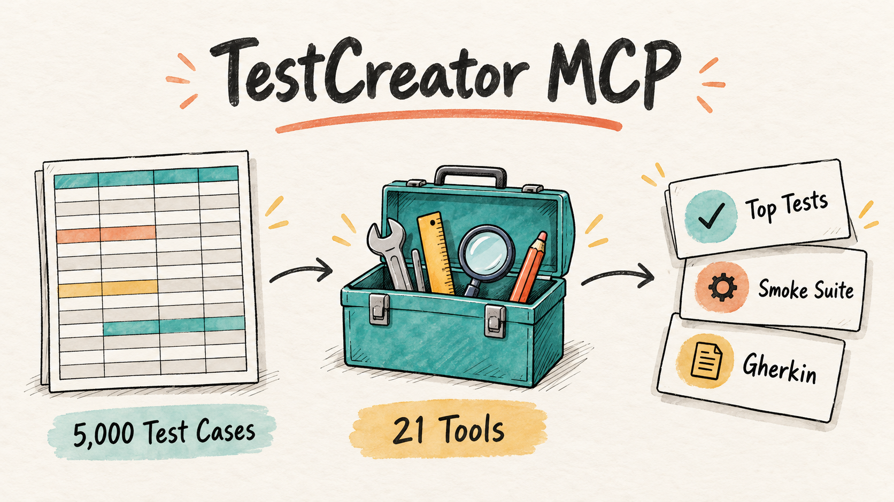

**Concept:** TestCreator MCP (TC MCP) is an MCP server, built with FastMCP 4.1, that turns a
5,000-row VWO test case CSV into 21 tools any MCP client can call. You can find tests by
module, priority, type, browser or device, rank what to run first, build smoke, sanity and
regression suites, find duplicates and coverage gaps, write new tests in the catalog format,
and export to Jira CSV, Markdown, Gherkin or Playwright stubs.

**Why:** a test catalog is too big to paste into a chat (about 950k tokens). Tools let the
assistant ask for exactly the 20 rows and the exact counts it needs, and any QA or dev can
share the same server.

The design, from data profile to phased build plan, is in
[`01_TestCreatorMCP.plan.md`](chapter_14_MCP_Create_VIBE/01_TestCreatorMCP.plan.md).

```bash
cd chapter_14_MCP_Create_VIBE/testcase-creator-mcp
uv sync && uv run pytest -q                        # 33 tests
uv run tc-mcp --transport http --port 8000        # http://127.0.0.1:8000/mcp
npx @modelcontextprotocol/inspector --transport http --server-url http://127.0.0.1:8000/mcp
```

#### Data first, then tools

The first prompt said "don't code", so the CSV was profiled before any tool was designed.
What it found shaped the server:

| Finding | Design response |
|---|---|
| Only 1,520 unique scenarios behind 5,000 rows, 466 exact duplicates | "Top N" keeps the best variant per scenario and spreads picks across features, so the top 10 is not 10 browser copies of one test. `find_duplicate_tests` lists them for cleanup |
| 415 Deprecated tests | Hidden by default in every tool, unless you ask for them |
| `A/B Testing` labels saved as `a`, `regression` doubled on Regression rows | Labels are repaired at load time. The source CSV is never edited |
| About 190 tokens per full row | Responses are capped at 100 compact rows or 25 full rows, with pagination |
| Users type `ab testing`, `sdk`, `safari`, `ios` | A resolver maps loose input to exact values and answers typos with "Did you mean 'Reports'?" |

```mermaid
flowchart LR
    C["MCP client<br/>Inspector, Claude Code, VS Code"] --> T{"stdio or<br/>stateless HTTP"}
    T --> TL["21 tools<br/>FastMCP 4.1"]
    TL --> RS["Resolver<br/>'ab' -> A/B Testing"]
    RS --> RP["Repository<br/>5,000 rows in memory"]
    CSV["vwo_5000_test_cases.csv<br/>read-only"] --> RP
    OV["tc_additions.csv<br/>overlay for writes"] --> RP
    RP --> RK["Ranking<br/>priority + status + type<br/>minus feature penalty"]
    RK --> O["Ranked rows<br/>with rank_reason"]

    classDef src fill:#57606a,stroke:#24292f,color:#fff
    classDef ai fill:#1f6feb,stroke:#0b3d91,color:#fff
    classDef gate fill:#bf8700,stroke:#7a5600,color:#fff
    classDef out fill:#2da44e,stroke:#0f5323,color:#fff
    class C,CSV,OV src
    class TL,RP ai
    class T,RS,RK gate
    class O out
```

A tool is a plain Python function. FastMCP turns the type hints into the JSON schema the
client sees, and the docstring into the description the LLM uses to choose the tool:

```python
# src/tc_mcp/tools/search.py (trimmed)
@mcp.tool(annotations=READ_ONLY, tags={"search", "planning"})
def get_top_tests_for_module(
    module: Annotated[str, Field(description="Module name, e.g. 'Reports', 'A/B Testing'. Aliases like 'ab', 'sdk' work.")],
    count: Annotated[int, Field(ge=1, le=50, description="How many tests to return (1-50).")] = 10,
    browser: Annotated[str | None, Field(description="Only this browser, e.g. 'Safari 19'.")] = None,
) -> dict[str, Any]:
    """Answer 'which tests should I run first for <module>?'. Returns a ranked shortlist,
    each row with a score and a rank_reason."""
    r = repo()
    resolved = resolve_module(module, r.modules)
    flt = TestFilter(module=resolved, browser=browser, status=["Ready", "Automated"], include_duplicates=False)
    rows, applied = r.filter(flt)
    picks = ranking.rank(rows, count, unique_scenarios=True)
    return {"module": resolved, "results": [p.as_dict() for p in picks]}
```

#### The 21 tools

| Group | Tools |
|---|---|
| Discovery | `list_modules`, `get_filter_options`, `get_test_stats` |
| Find | `get_test_case`, `search_test_cases`, `search_by_keyword`, `get_top_tests_for_module`, `get_similar_test_cases` |
| Planning | `build_test_suite`, `get_browser_device_matrix`, `get_automation_candidates`, `estimate_execution_effort` |
| Quality | `find_duplicate_tests`, `find_coverage_gaps`, `validate_test_case` |
| Authoring | `get_test_case_template`, `add_test_cases`, `update_test_case` |
| Export | `export_test_cases`, `convert_to_gherkin`, `generate_automation_stub` |

There are also 4 resources (`tc://schema`, `tc://modules`, `tc://stats/summary`,
`tc://test/{issue_key}`) and 3 prompts (`generate_test_cases`, `plan_release_run`,
`review_module_coverage`). The two write tools are hidden unless the server starts with
`--allow-write`, and even then they default to `dry_run=true`.

#### Connect from any MCP client

| Client | Connection |
|---|---|
| MCP Inspector | `npx @modelcontextprotocol/inspector --transport http --server-url http://127.0.0.1:8000/mcp` |
| Claude Code | `claude mcp add tc-mcp -- uv run --directory /ABS/PATH/chapter_14_MCP_Create_VIBE/testcase-creator-mcp tc-mcp` |
| VS Code (`.vscode/mcp.json`) | `{ "servers": { "tc-mcp": { "type": "http", "url": "http://127.0.0.1:8000/mcp" } } }` |
| No clone needed | `uvx --from "git+https://github.com/PramodDutta/AITesterBlueprint4x#subdirectory=chapter_14_MCP_Create_VIBE/testcase-creator-mcp" tc-mcp` |

Calling it from Python, with output from the real data:

```python
import asyncio
from fastmcp import Client

async def main():
    async with Client("http://127.0.0.1:8000/mcp") as client:
        top = await client.call_tool("get_top_tests_for_module", {"module": "Reports", "count": 3})
        for row in top.data["results"]:
            print(row["key"], row["rank_reason"])

asyncio.run(main())
# VWO-1029 Highest · Ready · Functional (score 56); 1st pick for feature 'scheduled email'
# VWO-3012 Highest · Ready · Functional (score 56); 1st pick for feature 'segment report'
# VWO-4898 Highest · Ready · Functional (score 56); 1st pick for feature 'report export'
```

The chapter [README](chapter_14_MCP_Create_VIBE/testcase-creator-mcp/README.md) has every
other option: Claude Desktop, Cursor, and a shared server with a bearer token.

#### Sharing it with students over a tunnel

A Cloudflare quick tunnel gives the local server a public HTTPS URL for as long as it runs:

```bash
uv run tc-mcp --transport http --port 8000        # read-only by default
cloudflared tunnel --url http://127.0.0.1:8000    # prints https://<random>.trycloudflare.com
```

In class, 14 students connected with MCP clients, and about 20 opened the link in a browser
and got `Bad Request: Missing session ID`. An MCP URL is not a web page: a browser sends a
plain `GET`, which the MCP transport rejects. There were two fixes. HTTP mode now runs
**stateless** (the tools keep no per-user state, so no session ID is needed), and a small ASGI
middleware ([`landing.py`](chapter_14_MCP_Create_VIBE/testcase-creator-mcp/src/tc_mcp/landing.py))
shows browsers a "how to connect" page. Stopping the tunnel takes the URL offline immediately.

**Q&A - why use this?**
- **Q: Why not just give the LLM the CSV?** A: 5,000 rows is about 950k tokens. Through tools, a question like "top 5 for Reports on Safari" costs one call and about 1k tokens, and counts come from code instead of the model's guess.
- **Q: Why does the server never call an LLM?** A: The client's model already reasons and writes. Keeping the server deterministic means it is free, works offline, needs no API keys to share, and gives the same answer every time.
- **Q: What's the gotcha?** A: Duplicates. Sorting 5,000 rows by priority gives you the same scenario on four browsers. Profile the data before designing tools: the 1,520 unique scenarios, not the 5,000 rows, are what the ranking has to work with.

#### TestSkill Finder MCP: 100 QA skills for any LLM

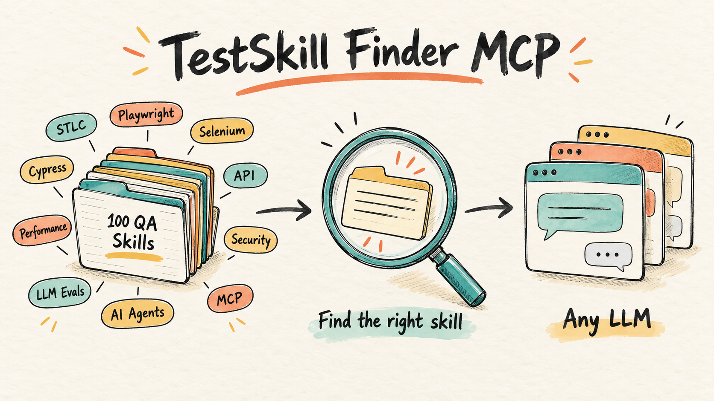

**Concept:** TestSkill Finder MCP serves a folder of 100 agent skills (each a `SKILL.md` with
YAML frontmatter and instructions) to any MCP client. It searches them by keyword or by a
plain-English task, chains them across the STLC, and exposes every skill as a prompt and a
resource. The [`skills/`](chapter_14_MCP_Create_VIBE/testskill-finder-mcp/skills/) folder is
the source of truth, and the server reloads whenever it changes.

**Why:** a skill library only helps if people can find the right skill at the moment they
need it, from whatever assistant they use. "Test case creator" should land on
`test-case-writer` even though no word matches exactly.

```bash
cd chapter_14_MCP_Create_VIBE/testskill-finder-mcp
uv sync && uv run pytest -q                                   # 42 tests
uv run testskill-finder-mcp --transport http                  # http://127.0.0.1:8110/mcp
npx @modelcontextprotocol/inspector --transport http --server-url http://127.0.0.1:8110/mcp
```

**Where the 100 skills come from:**
- **36 are synced** from [PramodDutta/skillmasterclass](https://github.com/PramodDutta/skillmasterclass/tree/main/skillmasterclass/skills) by the server's own `tsf-mcp sync`: 14 STLC skills, 11 Playwright and 11 Selenium.
- **64 were added** in the same format: 18 more STLC skills, plus packs for Cypress (8), API (6), performance (6), security (6), LLM evaluation (7), AI agents (5), MCP (5) and automation (3).
- The full list is in [`CATALOG.md`](chapter_14_MCP_Create_VIBE/testskill-finder-mcp/skills/CATALOG.md).

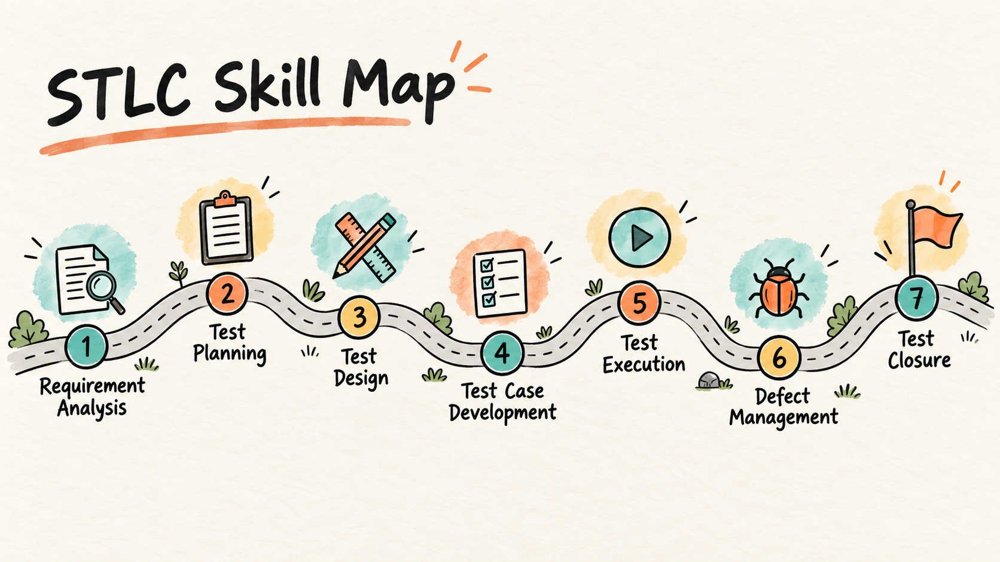

```mermaid
flowchart LR
    GH["skillmasterclass<br/>36 upstream skills"] -->|tsf-mcp sync| SK["skills/ folder<br/>100 SKILL.md"]
    NEW["64 new skills<br/>same format"] --> SK
    SK --> CAT["Catalog<br/>parse + auto-reload"]
    CAT --> IDX["Search index<br/>stems, synonyms, field weights"]
    IDX --> T["15 tools"]
    CAT --> P["103 prompts<br/>one per skill"]
    CAT --> R["Resources<br/>skill://name"]
    T --> LLM["Any LLM<br/>Claude, Copilot, Cursor"]
    P --> LLM
    R --> LLM

    classDef src fill:#57606a,stroke:#24292f,color:#fff
    classDef ai fill:#1f6feb,stroke:#0b3d91,color:#fff
    classDef gate fill:#bf8700,stroke:#7a5600,color:#fff
    classDef out fill:#2da44e,stroke:#0f5323,color:#fff
    class GH,NEW src
    class T,P,R ai
    class SK,CAT,IDX gate
    class LLM out
```

| Group | Tools |
|---|---|
| Discover | `list_categories`, `list_skills`, `get_catalog_stats` |
| Find | `search_skills`, `find_skill_for_task`, `get_skill`, `get_skill_file`, `get_related_skills`, `compare_skills` |
| Workflow | `suggest_skill_chain`, `get_stlc_pipeline`, `export_skill` (Claude Code, Copilot, Cursor) |
| Quality and write | `validate_skills`, plus `create_skill` and `sync_skills_from_github` when started with `--allow-write` |

Asking from Python, with output from the live server:

```python
import asyncio
from fastmcp import Client

async def main():
    async with Client("http://127.0.0.1:8110/mcp") as client:
        hits = await client.call_tool("find_skill_for_task", {"task": "evaluate my RAG chatbot answers with DeepEval", "top_k": 2})
        for row in hits.data["results"]:
            print(row["rank"], row["name"], "|", row["category"])

asyncio.run(main())
# 1 rag-evaluation-designer | LLM Evaluation
# 2 deepeval-test-writer | LLM Evaluation
```

#### How skill search works

| Query | Top result | Why it matches |
|---|---|---|
| Playwright API | `pw-api-tester` | `pw` is expanded to playwright, and both words are in the name |
| test case creator | `test-case-writer` | creator, writer and generator are one synonym group after stemming |
| test plan creator | `test-plan-generator` | the same synonym group, plus "test plan" in the name |
| test strategy | `test-strategy-designer` | exact name match, which weighs 6x the body |
| k6 load test | `k6-load-test-generator` | `k6` and `load` are in the performance synonym group |

Each skill is scored as term weight x IDF x field weight. The field weights are:

| Field | Weight |
|---|---|
| Name | 6 |
| Title | 4 |
| Trigger phrases | 3 |
| Category | 3 |
| Description | 2 |
| When to use | 1.5 |
| Body | 0.5 |

That score is then scaled by how many of your own words matched. `find_skill_for_task` also
compares your sentence with each skill's quoted "Use when ..." phrases. The 17 golden queries
above are pinned in tests, so a change to the scoring that breaks them fails the build.

**Q&A - why use this?**
- **Q: Why an MCP server instead of copying skills into `~/.claude/skills`?** A: Installed skills live on one machine and work with one agent. The server gives one searchable catalog to Claude, Copilot, Cursor or any LLM. `export_skill` still produces the folder, Copilot prompt file or Cursor rule when you want a skill installed.
- **Q: How do I add my own skill?** A: Drop a folder with a `SKILL.md` into the right phase or `framework-packs/<pack>-pack/` and run `uv run tsf-mcp validate`, or call `create_skill` on a server started with `--allow-write`. The server picks it up without a restart, and the skill gets its own prompt.
- **Q: What's the gotcha?** A: Upstream skills don't all share one exact layout (`test-plan-generator` writes "Workflow (follow in order)" with `### 1.` steps), so the parser matches headings by prefix. Sync also downloads files from the internet: it only writes inside `skills/`, refuses path traversal, never touches local skills, and never runs the scripts it downloads.

#### Files in this chapter

| File | What it is |
|---|---|
| [`00_Objective.md`](chapter_14_MCP_Create_VIBE/00_Objective.md) | The goal: tests by priority, module, min/max limits, top tests per module |
| [`01_TestCreatorMCP.plan.md`](chapter_14_MCP_Create_VIBE/01_TestCreatorMCP.plan.md) | Data profile, the 21-tool catalog, ranking formula, sharing options, phases |
| [`02_prompt.md`](chapter_14_MCP_Create_VIBE/02_prompt.md) | Every prompt used to build both servers, in order, with what happened |
| [`data/vwo_5000_test_cases.csv`](chapter_14_MCP_Create_VIBE/data/vwo_5000_test_cases.csv) | The catalog: 5,000 tests, 17 modules, 72 features |
| [`testcase-creator-mcp/`](chapter_14_MCP_Create_VIBE/testcase-creator-mcp/) | The FastMCP server: `src/tc_mcp/` (tools, repository, ranking, validation) and `tests/` |
| [`learnings/2026-10-10-csv-catalog-to-mcp-server.md`](learnings/2026-10-10-csv-catalog-to-mcp-server.md) | The approach and judgment calls, written down for reuse |
| [`testskill-finder-mcp/`](chapter_14_MCP_Create_VIBE/testskill-finder-mcp/) | The second server: `src/tsf_mcp/` (catalog, search, sync, tools, prompts) and `tests/` |
| [`testskill-finder-mcp/skills/`](chapter_14_MCP_Create_VIBE/testskill-finder-mcp/skills/) | The source of truth: 100 skills across 7 STLC phases and 10 packs, plus `CATALOG.md` |
| [`assets/`](chapter_14_MCP_Create_VIBE/assets/) | Three hand-drawn images rendered with Codex, with the briefs used to render them |
| [`learnings/2026-10-10-skill-library-mcp.md`](learnings/2026-10-10-skill-library-mcp.md) | How the skill finder was built: parallel writers, golden queries, sync safety |

### Chapters 13 and 15-21: coming next

Chapter 14 has landed (above). The other folders are in place, each holding a `.gitkeep`
until its content lands. After RAG, the course moves to giving LLMs tools (MCP), then the agent frameworks, then measuring whether any
of it works.

```mermaid
flowchart LR
    RAG["Ch 10-12<br/>RAG"] --> MCP["Ch 13-14<br/>MCP"]
    MCP --> PY["Ch 15<br/>Python + PyTest"]
    PY --> AG["Ch 16-18<br/>Agent frameworks"]
    AG --> EV["Ch 19-21<br/>LLM evaluation"]

    classDef src fill:#57606a,stroke:#24292f,color:#fff
    classDef ai fill:#1f6feb,stroke:#0b3d91,color:#fff
    classDef gate fill:#bf8700,stroke:#7a5600,color:#fff
    classDef out fill:#2da44e,stroke:#0f5323,color:#fff
    class RAG src
    class MCP,AG ai
    class PY gate
    class EV out
```

| Chapter | Topic | Folder |
|---|---|---|
| 13 | MCP Basics | `chapter_13_MCP_Basics/` |
| 15 | Python and PyTest | `chapter_15_Python_PyTest/` |
| 16 | AI Agents with CrewAI | `chapter_16_AI_Agent_Crew_AI/` |
| 17 | AI Agents with LangChain | `chapter_17_AI_Agent_LangChain/` |
| 18 | AI Agents with LangGraph | `chapter_18_AI_Agent_LangGraph/` |
| 19 | LLM Evaluation | `chapter_19_LLM_Eval/` |
| 20 | DeepEval Basics | `chapter_20_DeepEval_Basics/` |
| 21 | DeepEval Framework | `chapter_21_DeepEval_Framework/` |

## License

MIT
